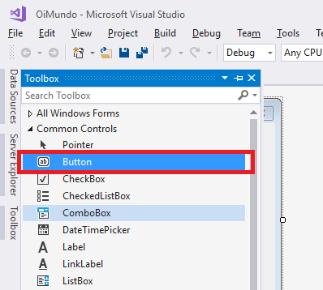
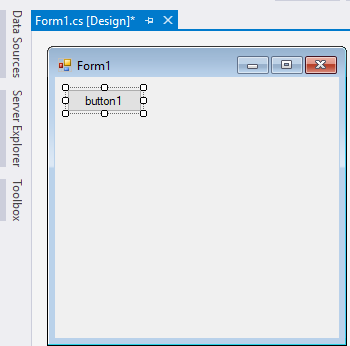
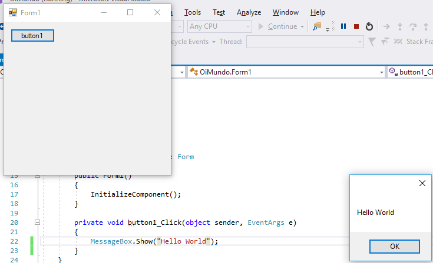

# O que é C# e .Net

## Um pouco sobre a história do C# e .Net

Entender um pouco da história do C# e do .Net é essencial para enxergar os motivos que a levaram ao sucesso.

No final da década de 1990 a Microsoft tinha diversas tecnologias e linguagens de programação para resolver muitos
problemas diferentes. Toda vez que um programador precisava migrar para uma nova linguagem, era necessário aprender
tanto a nova linguagem quanto suas bibliotecas e conceitos. Para solucionar esses problemas, a
Microsoft recorreu à linguagem Java.

O Java agradou os engenheiros da Microsoft pois com ela podíamos construir programas que eram independentes do
ambiente de execução, além de possuir diversas bibliotecas com soluções prontas para diversos problemas.
Para lançar produtos baseados no Java, a Microsoft assinou um acordo de licenciamento com a Sun para utilizar
o Java em ambiente Windows.

Porém, a linguagem Java possuía um grave problema: ela não se comunicava bem com as bibliotecas de código nativo
(código de máquina) que já existiam. Para resolver isso, a Microsoft decidiu criar a sua própria
implementação do Java chamado J++, que possuía extensões proprietárias que resolviam o problema de comunicação com o
código nativo existente. Para o desenvolvimento dessa nova implementação do Java, a Microsoft contratou um engenheiro
chamado Anders Hejlsberg, um dos principais nomes por trás do Delphi.

O J++ era uma versão da linguagem Java que só podia ser executada no ambiente Microsoft. Seu código não podia ser
executado em mais nenhum ambiente Java, o que violava o licenciamento feito com a Sun e, por isso, a Microsoft foi processada. Uma das mais conhecidas batalhas judiciais da época.

Sem o J++, a Microsoft foi obrigada a repensar sua estratégia sobre como lidar com as diferentes linguagens e
tecnologias utilizadas internamente. A empresa começou a trabalhar em um nova plataforma que seria a base de todas
as suas soluções, que posteriormente foi chamada de **.Net**. Esse novo ambiente de desenvolvimento
da Microsoft foi desde o início projetado para trabalhar com diversas linguagens de
programação, assim diversas linguagens diferentes compartilhariam o mesmo conjunto de bibliotecas. Com isso, para um
programador migrar de uma linguagem para outra ele precisaria apenas aprender a linguagem sem se preocupar com as
bibliotecas e APIs.

Além de uma plataforma a Microsoft também precisava de uma linguagem de programação. Um
novo projeto de linguagem de programação foi iniciado, o projeto COOL (C-like Object Oriented Language). Anders
Hejlsberg foi escolhido como engenheiro chefe desse novo projeto. COOL teve seu design baseado em diversas
outras linguagens do mercado como Java, C, C++, Smalltalk, Delphi e VB. A ideia era estudar os problemas existentes
e incorporar soluções.

Em 2002, o projeto COOL foi lançado como linguagem C# 1.0, junto com o ambiente .Net 1.0. Atualmente, a linguagem C# está em sua versão 7.0, e o .Net na versão 4.7, tendo evoluído com expressiva velocidade, adotando novidades na sua sintaxe que a diferenciaram bastante do Java e outras concorrentes.

## Máquina virtual

Em uma linguagem de programação como C e Pascal, temos a seguinte situação quando vamos compilar um
programa:

O código fonte é compilado para código de máquina específico de uma plataforma e sistema operacional.
Muitas vezes o próprio código fonte é desenvolvido visando uma única plataforma!

Esse código executável (binário) resultante será executado pelo sistema operacional e, por esse
motivo, ele deve saber conversar com o sistema operacional em questão. Isto é, temos um código
executável diferente para cada sistema operacional diferente.

Precisamos reescrever um mesmo pedaço da aplicação para diferentes sistemas operacionais, já que
eles não são compatíveis.

O C# utiliza o conceito de **máquina virtual**. Entre o sistema operacional
e a aplicação existe uma camada extra responsável por "traduzir" — mas não apenas isso — o que sua
aplicação deseja fazer para as respectivas chamadas do sistema operacional onde ela está rodando
no momento.

Repare que uma máquina virtual é um conceito bem mais amplo que o de um interpretador. Como o
próprio nome diz, uma máquina virtual é como um "computador de mentira": tem tudo que um computador
tem. Em outras palavras, ela é responsável por gerenciar memória, threads, a pilha de execução etc.

Sua aplicação roda sem nenhum envolvimento com o sistema operacional! Sempre conversando apenas
com a máquina virtual do C#, a _Common Language Runtime_ (**CLR**). A CLR é o ambiente de execução
para todas as linguagens da plataforma .Net, não apenas para o C#. Certamente isso não foi uma revolução. O Java trouxe esse conceito para o mercado e já havia muitas linguagens com esses recursos, apesar de que eram encontradas mais no meio acadêmico.

O CLR isola totalmente a aplicação do sistema operacional. Se uma aplicação rodando no CLR termina
abruptamente, ela não afetará as outras máquinas virtuais e nem o sistema operacional. Essa
camada de isolamento também é interessante quando pensamos em um servidor que não pode se
sujeitar a rodar código que possa interferir na boa execução de outras aplicações.

Como a máquina virtual deve trabalhar com diversas linguagens de programação diferentes, a CLR não pode
executar diretamente o código do C#, ela precisa executar uma linguagem intermediária comum a todas as
linguagens da plataforma .Net, a **CIL** (_Common Intermediate Language_). Para gerar o CIL que será executado
pela CLR, precisamos passar o código C# por um compilador da linguagem, como o programa `csc.exe`. O compilador
lê o arquivo com o código fonte do programa e o traduz para o código intermediário que será executado pela
máquina virtual.

> **Common Language Infrastructure**
>
> A infraestrutura necessária para executar os códigos escritos para a plataforma .Net é chamada de **CLI**
> (_Common Language Infrastructure_). A CLI engloba a máquina virtual do C# (CLR), a linguagem intermediária (CIL)
> e os tipos base utilizados nos programas.


## Execução do código na CLR e o JIT

Para executarmos uma aplicação C#, precisamos passar o código CIL do programa para a CLR, a máquina virtual do .Net.
A CLR por sua vez precisa executar o código da aplicação no sistema operacional do usuário e, para isso, precisa emitir
o código de máquina correto para o ambiente em que o programa está sendo executado. Mas a CLR não interpreta o CIL do
programa, isso seria muito lento, ao invés disso, quando o programa C# é carregado na memória, a CLR converte automaticamente o código CIL para código de máquina, esse processo é feito por um compilador **Just in Time**
(JIT) da CLR.

Esse carregamento utilizando o JIT faz com que o código escrito na linguagem C# execute com o desempenho
máximo, o mesmo de um programa escrito em linguagens que compilam diretamente para o código de máquina, mas com a
vantagem de executar no ambiente integrado do .Net.

## O ambiente de desenvolvimento do C# #

Nesse curso escreveremos todo o código utilizando o Visual Studio Comunity, a versão gratuita da ferramenta
de desenvolvimento de aplicações, que é distribuída pela própria Microsoft. Apesar das explicações serem feitas com base
na versão comunity, tudo funcionará da mesma forma dentro das versões pagas da ferramenta.

O Visual Studio Comunity pode ser encontrado no site:

https://www.visualstudio.com/pt-br/downloads/

A versão que utilizaremos na apostila é a Visual Studio Comunity 2017.

Durante a instalação do Visual Studio, o .Net Framework também será automaticamente instalado em sua máquina,
então ela estará pronta executar as aplicações escritas em C#.

## Executando aplicações sem o Visual Studio

Como vimos anteriormente, para executarmos uma aplicação C# precisamos da máquina virtual da linguagem além das
bibliotecas do .Net Framework. Ao instalarmos o Visual Studio, todo esse ambiente de execução de programas é
automaticamente instalado em nossas máquinas, mas e se quisermos executar o programa em um computador que não
tenha o Visual Studio instalado, o computador de um cliente, por exemplo?

Nesse caso precisamos instalar apenas o ambiente de execução no computador do cliente. Para isso podemos utilizar
um pacote de instalação fornecido pela própria Microsoft, esses são os .Net Framework Redistributable. O pacote de
instalação para a última versão do .Net Framework (4.5.1 lançada em 2013) pode ser encontrada no seguinte site:

```
http://www.microsoft.com/en-us/download/details.aspx?id=40779
```

> **C# em outros ambientes**
>
> Podemos também executar o código C# dentro de ambientes não windows utilizando implementações livres do Common
> Language Infrastructure. Uma implementação do ambiente de execução para ambientes não Windows é o Mono:
>
> ```
> http://www.mono-project.com/Main_Page
> ```


## O primeiro programa em C# #

Agora que já entendemos o funcionamento da linguagem C#, vamos começar a desenvolver a primeira aplicação utilizando
o Visual Studio. Para criarmos um programa C# utilizando o Visual Studio precisamos inicialmente de um novo projeto.

Dentro do Visual Studio 2017, aperte o atalho `Ctrl + Shift + N` para abrir o assistente de criação de novo projeto.


No canto esquerdo da janela do assistente de criação de novo projeto, podemos escolher a linguagem de programação
que desejamos utilizar, escolha a opção **Visual C#**. Como tipo de projeto escolha a opção
**Windows Form Application**, com isso estamos criando um novo projeto de interface gráfica utilizando o C#.

No canto inferior da janela, podemos escolher o nome do projeto além da pasta em que ele será armazenado. Utilizaremos
`OiMundo` como nome desse novo projeto.


Queremos inicialmente colocar um botão no formulário que, quando clicado, abrirá uma caixa de mensagem do Windows.

Para colocarmos o botão no formulário, precisamos abrir uma nova janela do Visual Studio chamada Toolbox, que fica
no canto esquerdo da janela do formulário. O Toolbox também pode ser aberto utilizando-se o atalho `Ctrl + Alt + X`.
Dentro da janela do "Toolbox", no grupo "Common Controls", clique no componente "Button" e arraste-o para o formulário.





Agora dê um duplo clique no botão que acabamos de adicionar para programarmos o que deve acontecer quando o botão for clicado. O Visual Studio abrirá o código do formulário. Não se preocupe com todo o código complicado que está escrito nesse arquivo, entenderemos o significado de cada uma dessas linhas mais a frente no curso.

```csharp
using System;
using System.Collections.Generic;
using System.ComponentModel;
using System.Data;
using System.Drawing;
using System.Linq;
using System.Text;
using System.Windows.Forms;

namespace form
{
    public partial class Form1 : Form
    {
        public Form1()
        {
            InitializeComponent();
        }

        private void button1_Click(object sender, EventArgs e)
        {
        
        }
    }
}
```

O trecho de código que nos interessa no momento é:

```csharp
private void button1_Click(object sender, EventArgs e)
{

}
```

Todo código que for colocado dentro das chaves será executado quando o botão for clicado.

No clique do botão, queremos executar o comando que mostra uma caixa de mensagens para o usuário.

```csharp
MessageBox.Show(mensagem)
```

No C#, todo comando deve ser terminado pelo caractere ";". Portanto, o código para mostrar a caixa de mensagem fica da seguinte forma:

```csharp
MessageBox.Show(mensagem);
```

Queremos que, ao clicar no botão, a mensagem `Hello World` seja exibida em uma caixa de mensagens. Então, utilizaremos o seguinte código:

```csharp
private void button1_Click(object sender, EventArgs e)
{
    MessageBox.Show(Hello World);
}
```

Como a mensagem é somente um texto, o compilador do C# nos força a colocá-la entre aspas duplas. Portanto, o código do clique do botão ficará assim:

```csharp
private void button1_Click(object sender, EventArgs e)
{
    MessageBox.Show("Hello World");
}
```

O código completo fica:

```csharp
using System;
using System.Collections.Generic;
using System.ComponentModel;
using System.Data;
using System.Drawing;
using System.Linq;
using System.Text;
using System.Windows.Forms;

namespace form
{
    public partial class Form1 : Form
    {
        public Form1()
        {
            InitializeComponent();
        }

        private void button1_Click(object sender, EventArgs e)
        {
            MessageBox.Show("Hello World");
        }
    }
}
```

Não se preocupe com as linhas de código que não foram explicadas. Entenderemos o que elas fazem durante o curso.

Aperte "F5" para executar o código do formulário. Ao clicar no "button1", o resultado deve ser algo parecido com a imagem a seguir:



## Exercícios
1. 
	

	Qual a mensagem que será exibida na caixa de texto criada pelo seguinte código?

    ```csharp
    MessageBox.Show("Curso de C# da Caelum");
    ```

	* Hello World

	* Curso de C# da Caelum

	* Olá Mundo

	* Caelum

	* Nenhuma das opções

	


## O que aconteceu durante a execução?

Vimos que quando apertamos a tecla F5 do teclado dentro do Visual Studio, nosso programa é executado. Agora vamos entender o que aconteceu.

Quando pedimos para o Visual Studio executar uma aplicação, ele chama o compilador da linguagem C# passando os arquivos de texto que contém o código da aplicação (código fonte do programa). Caso o código fonte não tenha nenhum erro de sintaxe, o compilador gera o código intermediário (CIL, Common Intermediate Language) que é entendido pela máquina virtual da linguagem C#, a CLR (Common Language Runtime). O código CIL é colocado em um arquivo executável (arquivo com extensão .exe) dentro da pasta do projeto. Esse arquivo que é resultado da compilação do programa é chamado de Assembly dentro da linguagem C#.

Depois da compilação, o Visual Studio executa o assembly gerado na máquina virtual do C#. A CLR por sua vez carrega o código CIL que foi gerado pelo compilador e o executa no sistema operacional, mas se a CLR interpretasse o código CIL para linguagem de máquina, o desempenho do C# não seria muito bom, e por isso, quando um programa C# é carregado pela CLR ele já é automaticamente convertido para linguagem de máquina por um processo conhecido como JIT (Just-in-time). Então no C#, o código sempre é executado com o mesmo desempenho do código de máquina.
