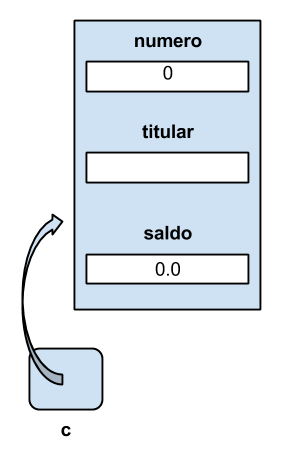
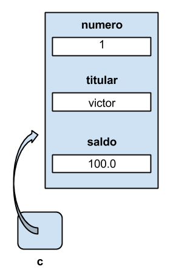
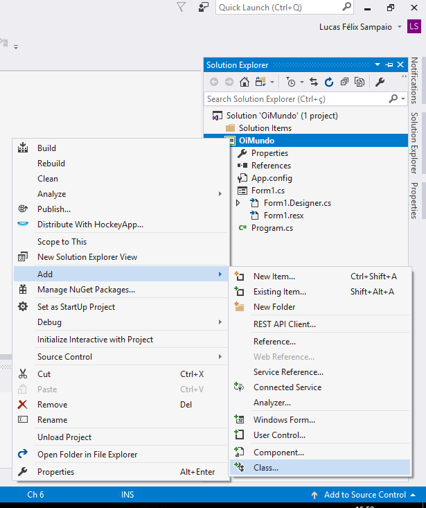
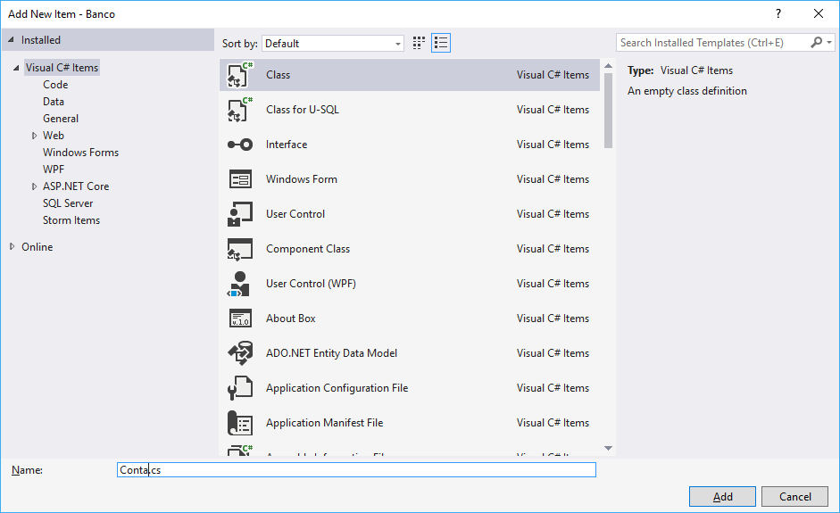

# Classes e objetos

Neste momento, queremos representar diversas contas em nosso banco. Uma conta bancária é geralmente composta por um número, nome do titular e saldo. Podemos guardar essas informações em variáveis:

``` csharp
int numeroDaConta1 = 1;
string titularDaConta1 = "Joaquim José";
double saldoDaConta1 = 1500.0;
```

Para representar outros correntistas, precisamos de novas variáveis:

``` csharp
int numeroDaConta2 = 2;
string titularDaConta2 = "Silva Xavier";
double saldoDaConta2 = 2500.0;
```

Veja que, como as informações das contas estão espalhadas em diversas variáveis diferentes, é muito fácil misturarmos essas informações dentro do código. Além disso, imagine que antes de adicionarmos a conta na aplicação precisamos fazer uma validação do CPF do titular. Nesse caso precisaríamos chamar uma função que executa essa validação, mas como podemos garantir que essa validação sempre é executada?

Esses pontos listados são alguns dos problemas do estilo de programação procedural. Quando trabalhamos com programação procedural, os dados da aplicação ficam separados da implementação das lógicas de negócio e, além disso, é muito difícil garantir as validações dos dados da aplicação.

## Organizando o código com Objetos

Para começarmos com a orientação a objetos, vamos inicialmente pensar quais são as informações que descrevem uma determinada Conta. Toda conta bancária possui um número, titular e saldo. Para representarmos a conta com essas informações dentro do projeto, no C#, precisamos criar uma **classe**. Dentro do C# a declaração da classe é feita utilizando-se a palavra **class** seguida do nome da classe que queremos implementar:

``` csharp
class Conta
{

}
```

O código da classe `Conta`, por convenção, deve ficar dentro de um arquivo com o mesmo nome da classe, então a classe `Conta` será colocado em arquivo chamado `Conta.cs`.

Dentro dessa classe queremos armazenar as informações que descrevem as contas, fazemos isso declarando variáveis dentro da classe, essas variáveis são os **atributos**:

``` csharp
class Conta
{
    int numero;
    string titular;
    double saldo;
}
```

Porém, para que o código da aplicação possa ler e escrever nesses atributos, precisamos declará-los utilizando a palavra `public`:

``` csharp
class Conta
{
    // numero, titular e saldo são atributos do objeto
    public int numero;
    public string titular;
    public double saldo;
}
```

Para utilizarmos a classe que criamos dentro de uma aplicação windows form, precisamos criar uma nova conta no código do formulário, fazemos isso utilizando a instrução `new` do C#:

``` csharp
// código do formulário
private void button1_Click(object sender, EventArgs e)
{
    new Conta();
}
```

Quando utilizamos o `new` dentro do código de uma classe estamos pedindo para o C# criar uma nova instância de `Conta` na memória, ou seja, o C# alocará memória suficiente para guardar todas as informações da `Conta` dentro da memória da aplicação.

Além disso, o new possui mais uma função, devolver a **referência**, uma seta que aponta para o objeto em memória, que será utilizada para manipularmos a `Conta` criada. Podemos guardar essa referência dentro de uma variável do tipo `Conta`:

``` csharp
// código do formulário
private void button1_Click(object sender, EventArgs e)
{
    Conta c = new Conta();
}
```

Na memória da aplicação teremos uma situação parecida com a ilustrada na imagem a seguir:



Veja que a classe funciona como uma receita que ensina qual é o formato de uma `Conta` dentro da aplicação. A `Conta` que foi criada na memória pelo operador `new` é chamada de **instância** ou **objeto**.

E agora para definirmos os valores dos atributos que serão armazenados na `Conta`, precisamos acessar o objeto que vive na memória. Fazemos isso utilizando o operador **.** do C#, informando qual é o atributo que queremos acessar. Para, por exemplo, guardarmos o valor 1 como número da conta que criamos, utilizamos o código a seguir:

``` csharp
// código do formulário
private void button1_Click(object sender, EventArgs e)
{
    Conta c = new Conta();
    c.numero = 1;
}
```

Com esse código, estamos navegando na referência armazenada na variável `c`, e acessando o campo número do objeto `Conta` que vive na memória. Dentro desse campo colocamos o valor 1. Podemos fazer o mesmo para os outros campos da `Conta`:

``` csharp
private void button1_Click(object sender, EventArgs e)
{
    Conta c = new Conta();
    c.numero = 1;
    c.titular = "victor";
    c.saldo = 100;
}
```

Depois da execução desse código, teremos a seguinte situação na memória da aplicação:



Veja que, quando utilizamos um objeto para guardar informações, todos os atributos ficam agrupados dentro de um único objeto na memória, e não espalhados dentro de diversas variáveis diferentes.

## Extraindo comportamentos através de métodos

Agora que conseguimos criar a primeira conta da aplicação, vamos tentar fazer algumas operações. A primeira operação que queremos implementar é a operação de tirar dinheiro da conta. Para isso, como vimos no capítulo anterior, podemos utilizar o operador `-=` do C#:

``` csharp
Conta c = new Conta();
c.numero = 1;
c.titular = "victor";
c.saldo = 100;
// a conta termina com saldo de 50.0
c.saldo -= 50.0;
```

Mas o que aconteceria se tentássemos tirar mais `100.0` dessa conta?

``` csharp
c.saldo -= 100.0;
```

Ao executarmos essa segunda operação, a conta terminará com saldo de `-50.0`, porém nesse sistema as contas não podem ficar com saldo negativo! Portanto, antes de tirarmos dinheiro da conta, precisamos verificar se ela possui saldo suficiente.

``` csharp
if(c.saldo >= 100.0)
{
    c.saldo -= 100.0;
}
```

Repare que teremos que copiar e colar essa verificação em todos os pontos da aplicação em que desejamos fazer um saque, mas o que aconteceria se fosse necessário cobrar uma taxa em todos os saques? Teríamos que modificar todos os pontos em que o código foi copiado. Seria mais interessante isolar esse código dentro de um comportamento da `Conta`.

Além de atributos, os objetos também podem possuir **métodos**. Os métodos são blocos de código que isolam lógicas de negócio do objeto. Então podemos isolar a lógica do saque dentro de um método `Saca` da classe `Conta`.

Para declarar um método chamado `Saca` na classe `Conta`, utilizamos a seguinte sintaxe:

``` csharp
class Conta
{
    // declaração dos atributos
   
    public void Saca()
    {
        // Implementação do método
    }
}
```

Dentro desse método `Saca`, colocaremos o código da lógica de saque.

``` csharp
public void Saca()
{
    if(c.saldo >= 100.0)
    {
        c.saldo -= 100.0;
    }
}
```

Porém, nesse código temos dois problemas: não podemos utilizar a variável `c`, pois ela foi declarada no formulário e não dentro do método e o valor do saque está constante.

Nesse método `Saca`, queremos verificar o saldo da conta em que o método foi invocado. Para acessarmos a referência em que um determinado método foi chamado, utilizamos a palavra `this`. Então para acessarmos o saldo da conta, podemos utilizar `this.saldo`:

``` csharp
public void Saca() 
{
    if(this.saldo >= 100.0)
    {
        this.saldo -= 100.0;
    }
}
```

Podemos utilizar o `Saca` dentro do formulário com o seguinte código:

``` csharp
Conta c = new Conta();
// inicializa as informações da conta
c.saldo = 100.0;

// Agora chama o método Saca que foi definido na classe
c.Saca();
```

Agora vamos resolver o problema do valor fixo do saque. Quando queremos passar um valor para um método, precisamos passar esse valor dentro dos parênteses da chamada do método:

``` csharp
Conta c = new Conta();
// inicializa as informações da conta
c.saldo = 100.0;

// Agora chama o método Saca que foi definido na classe
c.Saca(10.0);
```

Para recebermos o valor que foi passado na chamada do `Saca`, precisamos declarar um **argumento** no método. O argumento é uma variável declarada dentro dos parênteses do método:

``` csharp
public void Saca(double valor)
{
    if(this.saldo >= valor)
    {
        this.saldo -= valor;
    }
}
```

Um método pode ter qualquer número de argumentos. Precisamos apenas separar a declaração das variáveis com uma vírgula.

## Devolvendo valores de dentro do método

Agora que colocamos o método `Saca` dentro da classe `Conta`, não precisamos replicar o código de validação do saque em todos os pontos do código, podemos simplesmente utilizar o método criado, além disso, se precisarmos modificar a lógica do saque, podemos simplesmente atualizar o código daquele método, um único ponto do sistema.

Mas da forma que foi implementado, o usuário desse método não sabe se o saque foi ou não bem sucedido. Precisamos fazer com que o método devolva um valor booleano indicando se a operação foi ou não bem sucedida. Devolveremos `true` caso a operação seja bem sucedida e `false` caso contrário. Quando um método devolve um valor, o tipo do valor devolvido deve ficar antes do nome do método em sua declaração. Quando um método não devolve valor algum, utilizamos o tipo `void`.

``` csharp
// Estamos declarando que o método devolve um valor do tipo bool
public bool Saca(double valor)
{
    // implementação do método
}
```

Dentro da implementação do método, devolvemos um valor utilizamos a palavra **return** seguida do valor que deve ser devolvido. Então a implementação do `Saca` fica da seguinte forma:

``` csharp
public bool Saca(double valor)
{
    if(this.saldo >= valor)
    {
        this.saldo -= valor;
        return true;
    }
    else
    {
        return false;
    }
}
```

Quando o C# executa um `return`, ele imediatamente devolve o valor e sai do método, então podemos simplificar a implementação do Saca para:

``` csharp
public bool Saca(double valor)
{
    if(this.saldo >= valor)
    {
        this.saldo -= valor;
        return true;
    }
    return false;
}
```

No formulário podemos recuperar o valor devolvido por um método.

``` csharp
Conta c = new Conta();
// inicializa os atributos

// Se a conta tiver saldo suficiente, deuCerto conterá o valor true
// senão, ela conterá false
bool deuCerto = c.Saca(100.0);

if(deuCerto)
{
    MessageBox.Show("Saque realizado com sucesso");
}
else
{
    MessageBox.Show("Saldo Insuficiente");
}
```

Ou podemos utilizar o retorno do método diretamente dentro do `if`:

``` csharp
Conta c = new Conta();
// inicializa os atributos

if(c.Saca(100.0))
{
    MessageBox.Show("Saque realizado com sucesso");
}
else
{
    MessageBox.Show("Saldo Insuficiente");
}
```

## Valor padrão dos atributos da classe

Agora que terminamos de implementar a lógica de saque da conta, vamos também implementar o método de depósito. Esse método não devolverá nenhum valor e receberá um double como argumento:

``` csharp
public void Deposita(double valor)
{
    this.saldo += valor;
}
```

No formulário principal da aplicação, podemos inicializar o saldo inicial com o método `Deposita`:

``` csharp
Conta c = new Conta();
c.Deposita(100.0);
```

Nesse código estamos tentando depositar 100 reais em uma conta que acabou de ser criada e o método `Deposita` tenta somar os 100.0 no valor inicial do atributo saldo da conta. Mas qual é o valor inicial de um atributo?

Quando declaramos uma variável no C#, ela começa com um valor indefinido, logo não podemos utilizá-la enquanto seu valor não for inicializado, porém a linguagem trata os atributos de uma classe de forma diferenciada. Quando instanciamos uma classe, todos os seus atributos são inicializados para valores padrão. Valores numéricos são inicializados para zero, o `bool` é inicializado para false e atributos que guardam referências são inicializados para a referência vazia (valor `null` do C#).

Então, no exemplo, quando depositamos 100 reais na conta recém-criada, estamos somando 100 no saldo inicial da conta, que é zero, e depois guardando o resultado de volta no saldo da conta.

Podemos mudar o valor padrão de um determinado atributo colocando um valor inicial em sua declaração. Para inicializarmos a conta com saldo inicial de 100 reais ao invés de zero, podemos utilizar o seguinte código:

``` csharp
class Conta
{
    public double saldo = 100.0;
    
    // outros atributos e métodos da classe
}
```

Agora toda conta criada já começará com um saldo inicial de 100.0.

## Mais um exemplo: Transfere

Agora vamos tentar implementar a operação de transferência de dinheiro entre duas contas. Dentro da classe `Conta` criaremos mais um método chamado `Transfere`, esse método receberá o valor da transferência e as contas que participarão da operação:

``` csharp
public void Transfere(double valor, Conta origem, Conta destino)
{
    // implementação da transferência
}
```

Mas será que realmente precisamos receber as duas contas como argumento do método `Transfere`? Vamos ver como esse método será utilizado dentro do código do formulário:

``` csharp
Conta victor = new Conta();
// inicialização da conta
victor.saldo = 1000;

Conta guilherme = new Conta();
// inicialização da conta

// Agora vamos transferir o dinheiro da conta do victor para a do guilherme
victor.Transfere(10.0, victor, guilherme);
```

Repare que no uso do método estamos repetindo duas vezes a variável `victor`, porém isso não é necessário. Podemos utilizar o `this` para acessar a conta de origem dentro do método, então na verdade o método `Transfere` precisa receber apenas a conta de `destino`:

``` csharp
public void Transfere(double valor, Conta destino)
{
    // implementação da transferência
}
```

Antes de tirarmos dinheiro da conta de origem (`this`), precisamos verificar se ela tem saldo suficiente, somente nesse caso queremos sacar o dinheiro da conta de origem e depositar na conta de destino:

``` csharp
public void Transfere(double valor, Conta destino)
{
    if(this.saldo >= valor)
    {
        this.saldo -= valor;
        destino.saldo += valor;
    }
}
```

Mas esse comportamento de verificar se a conta tem saldo suficiente antes de realizar o saque é o comportamento do método `Saca` que foi implementado anteriormente, além disso, somar um valor no saldo é a operação `Deposita` da conta. Portanto, podemos utilizar os métodos `Saca` e `Deposita` existentes para implementar o `Transfere`:

``` csharp
public void Transfere(double valor, Conta destino)
{
    if(this.Saca(valor))
    {
        destino.Deposita(valor);
    }
}
```

## Convenção de nomes

Quando criamos uma classe, é importante lembrarmos que seu código será lido por outros desenvolvedores da equipe e, por isso, é recomendável seguir padrões de nomenclatura.

Quando criamos uma classe, a recomendação é utilizar o **Pascal Casing** para nomear a classe:


* Se o nome da classe é composto por uma única palavra, colocamos a primeira letra dessa palavra em maiúscula (conta se torna `Conta`);
* Se o nome é composto por diversas palavras, juntamos todas as palavras colocando a primeira letra de cada palavra em maiúscula (seguro de vida se torna `SeguroDeVida`).


No caso do nome de métodos, a convenção também é utilizar o Pascal Casing (Saca e Deposita, por exemplo).

Para argumentos de métodos, a recomendação é utilizar o Pascal Casing porém com a primeira letra em minúscula (`valorDoSaque`, por exemplo), uma convenção chamada Camel Casing.

Você pode encontrar as recomendações da Microsoft nesse link: 
`http://msdn.microsoft.com/en-us/library/ms229040(v=vs.110).aspx`

## Exercícios
1. O que uma classe tem?

	* Só os atributos de uma entidade do sistema;

	* Só atributos ou só métodos de uma entidade do sistema;

	* Só os métodos de uma entidade do sistema;

	* Atributos e métodos de uma entidade do sistema.

	

1. Vamos criar a classe `Conta` dentro do projeto inicial utilizando o Visual Studio.

	No Visual Studio clique com o botão direito no nome do projeto e selecione a opção `Add > Class...`

	

	Dentro da janela aberta pelo Visual Studio, precisamos definir qual é o nome da classe que queremos criar. Escolha o nome `Conta`:

	

	Depois de colocar o nome da classe, clique no botão `Add`. Com isso, o Visual Studio criará um novo arquivo dentro do Projeto, o `Conta.cs`. Todo o código da classe `Conta` ficará dentro desse arquivo:

	``` csharp
 class Conta
 {
    // O código da classe fica aqui dentro!
 }
	```

	Agora declare os seguintes atributos dentro da `Conta`: `saldo` (double), `titular` (string) e `numero` (int).
1. Qual dos comandos a seguir instancia uma nova Conta?

	* Conta conta = Conta();

	* Conta conta = new Conta();

	* Conta conta = Conta.new();

	
    
1. Levando em consideração o código:

	``` csharp
 Conta c = new Conta();
 c.saldo = 1000.0;
	```

	Qual das linhas a seguir adiciona 200 reais nesse saldo?

	* saldo += 200;

	* c.saldo += 200;

	* Conta c.saldo += 200;

	* Conta.saldo += 200;

	
1. Agora vamos testar a classe `Conta` que acabamos de criar. Coloque um novo botão no formulário da aplicação. Dê um duplo clique nesse botão para definirmos qual será o código executado no clique do botão.

	``` csharp
 private void button1_Click(object sender, EventArgs e)
 {
    // ação do botão aqui.
 }
	```

	Dentro do código desse botão, instancie uma nova `Conta` e tente fazer alguns testes preenchendo e mostrando seus atributos através do `MessageBox.Show`. Por exemplo:

	``` csharp
 private void button1_Click(object sender, EventArgs e)
 {
    Conta contaVictor = new Conta();
    contaVictor.titular = "victor";
    contaVictor.numero = 1;
    contaVictor.saldo = 100.0;

    MessageBox.Show(contaVictor.titular);
 }
	```

	Tente fazer testes com diversas contas e veja que cada instância de conta possui seus próprios atributos.
1. Agora vamos implementar métodos na classe `Conta`. Começaremos pelo método `Deposita`, esse método não devolve nada e deve receber um argumento do tipo `double` que é o valor que será depositado na `Conta`. A sua classe deve ficar parecida com a que segue:

	``` csharp
 // dentro do arquivo Conta.cs

 class Conta
 {
    // declaração dos atributos

    public void Deposita(double valor)
    {
        // o que colocar aqui na implementação?
    }
 }
	```

	Depois de implementar o método `Deposita`, implemente também o método `Saca`. Ele também não devolve valor algum e recebe um `double` que é o valor que será sacado da conta.
1. Agora vamos testar os métodos que acabamos de criar. Na ação do botão que utilizamos para testar a conta, vamos manipular o saldo utilizando os métodos `Deposita` e `Saca`:
	``` csharp
 private void button1_Click(object sender, EventArgs e)
 {
    Conta contaVictor = new Conta();
    contaVictor.titular = "victor";
    contaVictor.numero = 1;
    contaVictor.Deposita(100);
    MessageBox.Show("Saldo: " + contaVictor.saldo);
    contaVictor.Saca(50.0);
    MessageBox.Show("Saldo: " + contaVictor.saldo);
 }
	```

	Tente fazer depósitos e saques em várias instâncias diferentes de `Conta`, repare que dentro dos métodos a variável `this` possui o valor da referência em que o método foi invocado.
1. Qual a saída do código a seguir:

	``` csharp
 Conta mauricio = new Conta();
 mauricio.saldo = 2000.0;

 Conta guilherme = new Conta();
 guilherme.saldo = 5000.0;

 mauricio.saldo -= 200.0;
 guilherme.saldo += 200.0;

 MessageBox.Show("mauricio = " + mauricio.saldo);
 MessageBox.Show("guilherme = " + guilherme.saldo);
	```

	* mauricio = 2200.0 e guilherme = 4800.0

	* mauricio = 2200.0 e guilherme = 5200.0

	* mauricio = 1800.0 e guilherme = 5000.0

	* mauricio = 1800.0 e guilherme = 5200.0

	
1. Qual a saída do código a seguir?

	``` csharp
 Conta mauricio = new Conta();
 mauricio.numero = 1;
 mauricio.titular = "Mauricio";
 mauricio.saldo = 100.0;

 Conta mauricio2 = new Conta();
 mauricio2.numero = 1;
 mauricio2.titular = "Mauricio";
 mauricio2.saldo = 100.0;

 if (mauricio == mauricio2)
 {
	MessageBox.Show("As contas são iguais");
 }
 else
 {
	MessageBox.Show("As contas são diferentes");
 }
	```

	* As contas são iguais

	* As contas são diferentes

	* Não é mostrado nenhuma mensagem

	
1. Qual a saída do código a seguir:

	``` csharp
 Conta mauricio = new Conta();
 mauricio.saldo = 2000.0;

 Conta copia = mauricio;
 copia.saldo = 3000.0;

 MessageBox.show("mauricio = " + mauricio.saldo);
 MessageBox.show("copia = " + copia.saldo);
	```

	* mauricio = 2000.0 e copia = 3000.0

	* mauricio = 3000.0 e copia = 2000.0

	* mauricio = 2000.0 e copia = 2000.0

	* mauricio = 3000.0 e copia = 3000.0

	
1. (Opcional) Implemente o método `Transfere` que recebe o valor da transferência e a conta de destino. Faça com que ele reutilize as implementações dos métodos `Saca` e `Deposita`.

1. (Opcional) Vamos adicionar uma validação no método `Saca` da `Conta`. Modifique o método `Saca` para que ele não realize o saque caso o saldo atual da conta seja menor do que o valor recebido como argumento.
1. (Opcional) Modifique o método `Saca` com validação para que ele devolva o valor `true` caso o saque tenha sido realizado com sucesso e `false` caso contrário. Depois modifique o código do botão de teste da conta para que ele utilize o valor devolvido pelo método `Saca` para mostrar uma mensagem para o usuário. Caso o saque seja bem sucedido, queremos mostrar a mensagem "Saque realizado com sucesso", se não, mostraremos "Saldo insuficiente"
1. (Opcional) Agora altere o método `Saca` da classe Conta.
	Limite o valor do saque para R$ 200,00 caso o cliente seja menor de idade.

	Lembre-se que ainda é necessário validar se o valor a ser sacado é menor ou igual ao saldo atual do cliente e é maior do que R$ 0,00.

## Composição de classes

Quando abrimos uma conta no banco, temos que fornecer uma série de informações: nome, CPF, RG e endereço.

Vimos que quando queremos armazenar informações em uma classe, devemos criar atributos. Mas em qual classe colocar esses novos atributos? Claramente essas informações não pertencem a uma `Conta`. Esses dados pertencem ao titular da conta, ou seja, essas informações pertencem ao cliente do banco.

Então devemos armazená-las em uma classe `Cliente`.
``` csharp
class Cliente 
{
    public string nome;
    public string cpf;
    public string rg;
    public string endereco;
}
```
Sabemos também que toda conta está associada a um cliente, ou seja, a conta guarda uma referência ao cliente associado.
``` csharp
class Conta 
{
    // outros atributos da Conta
    
    public Cliente titular;
    
    // comportamentos da conta
}
```
Agora, quando vamos criar uma conta, podemos também colocar seu titular.

``` csharp
Cliente victor = new Cliente();
victor.nome = "victor";

Conta umaConta = new Conta();
umaConta.titular = victor;
```

Vimos também que o atributo `titular` guarda uma referência(seta) para uma instância de `Cliente` (objeto na memória). Logo, a atribuição `umaConta.titular = victor` está copiando a referência da variável `victor` para o atributo `titular`.

Podemos modificar os atributos do `Cliente` através da referência guardada no atributo `titular` da `Conta`.

``` csharp
Cliente victor = new Cliente();
victor.nome = "victor";

Conta umaConta = new Conta();
umaConta.titular = victor;

umaConta.titular.rg = "12345678-9";

// Mostra o nome victor
MessageBox.Show(umaConta.titular.nome);

// Mostra o texto 12345678-9
MessageBox.Show(victor.rg);
```

## Exercícios
1. Crie a classe `Cliente` contendo os atributos `nome` (string), `rg` (string), `cpf` (string) e `endereco` (string). Modifique a classe `Conta` e faça com que seu atributo `titular` seja do tipo `Cliente` ao invés de `string`.

	Tome cuidado. Após essa modificação não poderemos atribuir o nome do cliente diretamente ao atributo `titular` da `Conta`. Para definir o nome do titular, precisaremos de um código parecido com o que segue:

	``` csharp
 Conta conta = new Conta();
 Cliente cliente = new Cliente();
 conta.titular = cliente;
 conta.titular.nome = "Victor";
	```

	
1. Qual a saída que será impressa ao executar o seguinte trecho de código?

	``` csharp
 Conta umaConta = new Conta();
 Cliente guilherme = new Cliente();
 guilherme.nome = "Guilherme Silveira";
 umaConta.titular = guilherme;

 MessageBox.Show(umaConta.titular.nome);
	```

	* Guilherme Silveira

	* Será mostrado uma caixa de mensagem sem nenhuma mensagem

	* O código não compila

	
1. Qual a saída que será impressa ao executar o seguinte trecho de código?

	``` csharp
 Conta umaConta = new Conta();
 Cliente guilherme = new Cliente();
 guilherme.rg = "12345678-9";

 umaConta.titular = guilherme;
 umaConta.titular.rg = "98765432-1";

 MessageBox.Show(guilherme.rg);
	```

	* 98765432-1

	* 12345678-9

	* rg

	* Não será impresso nada

	
1. (Opcional) Crie mais um atributo na classe `Cliente` que guarda a idade da pessoa. No nosso caso, a idade é um número inteiro.

	Também crie um comportamento (método) com o nome `EhMaiorDeIdade` na classe `Cliente` que não recebe nenhum argumento e retorna um booleano indicando se o cliente é maior de idade ou não. Quando uma pessoa é maior de idade no Brasil?
	

