# Introdução ao Visual Studio com Windows Form

Agora que já sabemos os conceitos básicos de Orientação a Objetos, chegou a hora de aprendermos como ganhar produtividade utilizando o Visual Studio para desenvolver uma interface gráfica para o projeto do banco. Vamos criar um novo projeto utilizando o atalho "Ctrl + Shift + N" do Visual Studio. Esse atalho abrirá a janela de novo projeto. Nessa janela escolheremos novamente o tipo "Windows Form App". O nome desse novo projeto será "**Banco**".


Dentro desse projeto, queremos colocar campos de texto para mostrar as informações da conta, para isso utilizaremos um novo componente do Windows form chamado `TextBox`. Colocaremos três `TextBox` dentro do formulário.

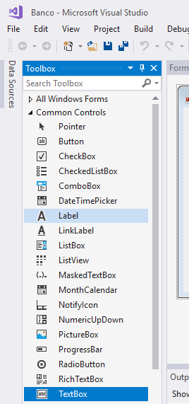

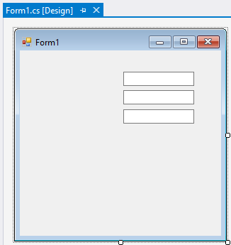

Para definir o texto que será exibido no `TextBox`, precisaremos de uma variável que guardará a referência para o componente `TextBox`. Para definir o nome dessa variável, devemos clicar com o botão direito no `TextBox` e escolher a opção `Properties`

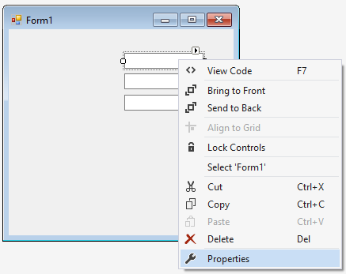

O Visual C# colocará a janela `Properties` em destaque:

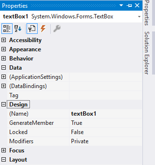

Dentro da `Properties`, procure o campo `(Name)`. O nome que for colocado nesse campo será o nome da variável que conterá a referência para a instância de `TextBox`. Vamos, por exemplo, definir que o nome do campo será `textoTitular`.

Podemos utilizar a referência para o `TextBox` para definir o texto que será exibido:

``` csharp
textoTitular.Text = "Texto da minha caixa da texto";
```

Vamos chamar os outros `TextBox` de `textoNumero` e `textoSaldo`. Agora precisamos definir o código do formulário que será utilizado para preencher as informações do formulário.

## Introdução prática aos atalhos do Visual Studio

Para fazer com que o formulário comece preenchido com a informação do titular da conta, precisamos criar um método no formulário que será responsável por sua inicialização. Podemos criar esse método dando um duplo clique no formulário:

``` csharp
private void Form1_Load(object sender, EventArgs e)
{
  // carregue os campos de seu formulário aqui
}
```

Dentro desse método, queremos preencher as informações do formulário com os dados de uma conta que será instanciada. Vamos inicialmente instanciar a conta que será gerenciada pela aplicação:

``` csharp
private void Form1_Load(object sender, EventArgs e)
{
    Conta c = new Conta();
}
```

Porém esse código gera um erro de compilação pois nesse projeto ainda não criamos a classe `Conta`. Faremos o Visual Studio gerar a declaração dessa classe. Coloque o cursor do teclado sobre o nome da classe `Conta` e aperte o atalho `Ctrl + .`, o Visual Studio dará a opção `Generate class for 'Conta'`:

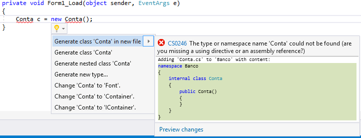

Não precisamos nos preocupar em criar cada classe do projeto manualmente, podemos deixar o próprio Visual Studio fazer o trabalho! Mude a visibilidade da classe gerada para `public`.

``` csharp
// Arquivo Conta.cs
public class Conta
{

}
```

Agora vamos voltar ao código do formulário e inicializar a propriedade `Numero` da conta da variável `c`:

``` csharp
private void Form1_Load(object sender, EventArgs e)
{
    Conta c = new Conta();
    c.Numero = 1;
}
```

Ao adicionarmos essa linha, teremos novamente um erro de compilação, pois a conta ainda não possui a propriedade `Numero`. Coloque o cursor sobre a propriedade `Numero` e aperte novamente o `Ctrl + .`. Dessa vez o visual studio mostrará a opção **Generate property stub for 'Numero' in 'Banco.Conta'**, escolha essa opção.

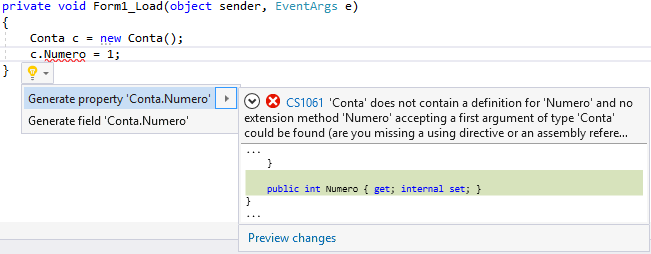

Com isso a propriedade será criada automaticamente dentro da classe `Conta`.

``` csharp
public class Conta
{
    public int Numero { get; set; }
}
```

Vamos também declarar a propriedade `Saldo` dentro da `Conta`, para isso utilizaremos um novo atalho do visual studio. Abaixo da propriedade `Numero` que foi declarada anteriormente, digite `prop` e depois aperte a tecla `tab` duas vezes:

``` csharp
public class Conta
{
    public int Numero { get; set; }
    
    prop + <tab> + <tab>
}
```

Esse é o atalho para declarar uma nova propriedade pública dentro do código.

``` csharp
public class Conta
{
    public int Numero { get; set; }
    
    public int MyProperty { get; set; }
}
```

Veja que, na propriedade criada pelo visual studio, o tipo da propriedade e seu nome estão marcados com uma cor de fundo diferente porque ainda não falamos qual será o tipo e o nome da nova propriedade. Como estamos criando a propriedade para o saldo da conta, colocaremos o tipo `double`. Depois de definir o tipo da propriedade, aperte a tecla `tab`, isso mudará o foco do editor para o nome da propriedade. Digite o nome `Saldo`:

``` csharp
public class Conta
{
    public int Numero { get; set; }
    
    public double Saldo { get; set; }
}
```

Mas apenas a conta pode alterar o `Saldo`, as outras classes devem conseguir fazer apenas a leitura. Por isso marcaremos o `set` da propriedade com a palavra `private`.

``` csharp
public double Saldo { get; private set; }
```

Da mesma forma que criamos a propriedade com o atalho `prop + <tab> + <tab>
`, também podemos criar um construtor para a classe utilizando o `ctor + <tab> + <tab>`.

Para terminar a declaração das propriedades da conta, vamos colocar o `Titular`. Volte à classe do formulário principal da aplicação. Dentro do código da inicialização formulário, instancie um novo cliente passando seu nome como argumento do construtor:

``` csharp
private void Form1_Load(object sender, EventArgs e)
{
    Conta c = new Conta();
    c.Numero = 1;
    Cliente cliente = new Cliente("victor");
}
```

Isso novamente fará o Visual Studio apontar erros de compilação no código e, novamente, utilizaremos o `Ctrl + .` para corrigir esse erro. Coloque o cursor do teclado sobre o tipo cliente, aperte `Ctrl + .` e selecione a opção `Generate class for 'Cliente'`. Modifique a visibilidade da classe criada para `public` e volte novamente à classe do formulário.

O código do formulário ainda possui o erro de compilação porque a classe `Cliente` que acabamos de criar não possui um construtor que recebe uma `string` como argumento. Então vamos novamente colocar o cursor do teclado sobre o erro de compilação, apertar `Ctrl + .` e escolher a opção `Generate constructor stub in 'Banco.Cliente'`.

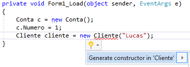

Com isso criamos automaticamente o construtor dentro da classe `Cliente`.

``` csharp
public class Cliente
{
    private string p;
    
    public Cliente(string p)
    {
        this.p = p;
    }
}
```

Veja que no código do construtor o valor do argumento passado é guardado dentro de um atributo que foi declarado automaticamente, porém queremos guardar esse valor dentro de uma propriedade chamada `Nome` do `Cliente`. Apague o atributo que foi criado automaticamente pelo visual studio e depois modifique o código do construtor para:

``` csharp
public class Cliente
{
    public Cliente(string p)
    {
        this.Nome = p;
    }
}
```

Quando modificarmos o código, o Visual Studio automaticamente mostrará um erro de compilação na classe `Cliente` porque a propriedade `Nome` ainda não foi declarada, então vamos criá-la. Dentro do código do construtor, coloque seu cursor sobre a palavra `Nome` e depois aperte `Ctrl + .`, escolha a opção `Generate property stub for 'Nome' in 'Banco.Cliente'`. Com isso, o Visual Studio criará automaticamente a propriedade `Nome` dentro da classe `Cliente`:

``` csharp
public class Cliente
{
    public Cliente(string p)
    {
        this.Nome = p;
    }
    
    public string Nome { get; set; }
}
```

Agora voltando ao código do formulário, precisamos guardar o cliente que foi criado na propriedade `Titular` da `Conta`:

``` csharp
private void Form1_Load(object sender, EventArgs e)
{
    Conta c = new Conta();
    c.Numero = 1;
    Cliente cliente = new Cliente("victor");
    c.Titular = cliente;
}
```

Com esse código temos novamente um erro de compilação, então utilizaremos o `Ctrl + .` para criar a propriedade `Titular` dentro da `Conta`.

## A classe Convert

Depois de criarmos a classe `Conta`, precisamos mostrar seus dados nos `TextBox`'s que foram adicionados. Como vimos, para colocar o texto que será mostrado em um `TextBox`, precisamos apenas escrever na propriedade `Text` do objeto. Então para mostrarmos o nome do titular, precisamos do seguinte código:

``` csharp
private void Form1_Load(object sender, EventArgs e)
{
    Conta c = new Conta();
    // inicializa a Conta c
    
    textoTitular.Text = c.Titular.Nome;
}
```

No caso do número da conta, precisamos convertê-lo para uma `string` antes de escrevê-lo na propriedade `Text`.

Quando queremos fazer conversões entre os tipos básicos do C#, utilizamos uma classe chamada `Convert` do C#. Dentro dessa classe, podemos utilizar o método `ToString` para converter um tipo primitivo da linguagem para uma `string`. O código para mostrar as propriedades `Numero` e `Saldo` da conta fica da seguinte forma:

``` csharp
textoNumero.Text = Convert.ToString(c.Numero);
textoSaldo.Text = Convert.ToString(c.Saldo);
```

## Operações na conta: saque e depósito

Agora vamos implementar botões no formulário que manipulam a conta que está sendo exibida. Vamos inicialmente implementar a operação de depósito. Para isso, arraste para dentro do formulário uma nova caixa de texto e faça com que o nome da variável dessa caixa seja `textoValor`. Além dessa caixa, arraste um novo botão para o formulário. Quando o usuário clicar nesse botão, o código deve ler o valor digitado na caixa `textoValor` e convertê-lo para um `double` que será passado para o método `Deposita`.

Dê um duplo clique no botão para associar uma ação em seu evento de clique. Dentro da ação do botão, para pegarmos o texto que foi digitado no `textoValor`, precisamos apenas ler a sua propriedade `Text`:

``` csharp
private void button1_Click(object sender, EventArgs e)
{
    string valorDigitado = textoValor.Text;
}
```

Agora precisamos fazer a conversão do `valorDigitado` para o tipo `double` do C#. Para realizar essa conversão, utilizaremos o método `ToDouble` da classe `Convert`:

``` csharp
private void button1_Click(object sender, EventArgs e)
{
    string valorDigitado = textoValor.Text;
    double valorOperacao = Convert.ToDouble(valorDigitado);
}
```

E agora que temos o valor da operação no tipo correto, vamos utilizar o método `Deposita` da classe `Conta`:

``` csharp
private void button1_Click(object sender, EventArgs e)
{
    string valorDigitado = textoValor.Text;
    double valorOperacao = Convert.ToDouble(valorDigitado);
    c.Deposita(valorOperacao);
}
```

Mas a ação desse botão não pode acessar uma variável que foi declarada dentro do método `Form1_Load`. Para que a mesma conta possa ser utilizada em diferentes métodos do formulário, ela precisa ser declarada como um atributo da classe do formulário que foi gerada pelo Visual Studio:

``` csharp
public class Form1 : Form
{
    private Conta c;
    
    // resto da classe do formulário.
}
```

Dentro do `Form1_Load`, guardaremos a conta criada dentro do novo atributo do formulário:

``` csharp
private void Form1_Load(object sender, EventArgs e)
{
    // Cria uma nova conta e guarda sua referência no atributo do formulário
    this.c = new Conta();
    
    // inicializa e mostra a conta no formulário
}
```

Como a conta é um atributo do formulário, podemos acessá-la a partir do método `button1_Click`. Mas ainda temos um erro de compilação porque o método `Deposita` não existe na classe `Conta`. Então vamos criá-lo utilizando o Visual Studio. Dentro do método `button1_Click`, coloque o cursor do teclado sobre o método `Deposita` e aperte `Ctrl + .`, e depois escolha a opção `Generate Method stub for 'Deposita' in 'Banco.Conta'`.

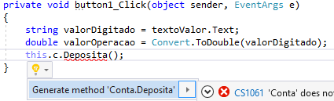

Com isso, o Visual Studio automaticamente colocará o método dentro da classe `Conta`.

``` csharp
internal void Deposita(double p)
{
    throw new NotImplementedException();
}
```

Apague a implementação padrão desse método, mude sua visibilidade para `public` e, por fim, faça a sua implementação para a lógica de depósito. O código deve ficar parecido com o que segue:

``` csharp
public void Deposita(double valorOperacao)
{
    this.Saldo += valorOperacao;
}
```

Para terminar a lógica de depósito, precisamos apenas atualizar o valor do saldo na interface do usuário. Abra novamente a ação do botão de depósito dentro do código do formulário principal da aplicação (método `button1_Click` da classe `Form1`). Dentro desse método, vamos atualizar o texto mostrado no campo `textoSaldo` com o valor do saldo da conta:

``` csharp
private void button1_Click(object sender, EventArgs e)
{
    string valorDigitado = textoValor.Text;
    double valorOperacao = Convert.ToDouble(valorDigitado);
    this.c.Deposita(valorOperacao);
    textoSaldo.Text = Convert.ToString(this.c.Saldo);
}
```

Para finalizarmos essa ação, podemos avisar o usuário que a operação foi realizada com sucesso utilizando um message box. Colocaremos a caixa de mensagem utilizando o atalho `mbox + <tab> + <tab>`, esse atalho declara o código do `MessageBox.Show`:

``` csharp
private void button1_Click(object sender, EventArgs e)
{
    string valorDigitado = textoValor.Text;
    double valorOperacao = Convert.ToDouble(valorDigitado);
    this.c.Deposita(valorOperacao);
    textoSaldo.Text = Convert.ToString(this.c.Saldo);
    MessageBox.Show("Sucesso");
}
```

## Controlando o nome da ação de um botão

Como vimos, a ação de um botão do formulário é um método declarado na classe do formulário que contém o botão. Vimos também que o Visual Studio gera o nome dos métodos na forma `button<numero>_Click`. Esse é um nome que pode facilmente causar confusão e gerar problemas de manutenção do código.

Esse nome gerado pelo Visual Studio na verdade é baseado na propriedade `(Name)` do componente `Button`. Então, para que o Visual Studio gere nomes mais amigáveis para os botões, podemos simplesmente mudar o `(Name)` do botão na janela `Properties`.

Vamos colocar um novo botão no formulário que implementará a operação de saque. Arraste um novo botão para o formulário e como `(Name)` desse botão utilize `botaoSaque`. Agora dê um duplo clique no novo botão para gerar o código de sua ação de clique. Isso criará um novo método chamado `botaoSaque_Click`:

``` csharp
private void botaoSaque_Click(object sender, EventArgs e)
{
    string valorDigitado = textoValor.Text;
    double valorOperacao = Convert.ToDouble(valorDigitado);
    this.c.Saca(valorOperacao);
    textoSaldo.Text = Convert.ToString(this.c.Saldo);
    MessageBox.Show("Sucesso");
}
```

Resta apenas implementarmos o método `Saca` da `Conta`:

``` csharp
public void Saca(double valor)
{
    this.Saldo -= valor;
}
```

Mude também o `(Name)` do botão de depósito para `botaoDeposito`. Na próxima seção aprenderemos como renomear o nome da ação do botão sem causar problemas de compilação.

> **Texto do botão**
>
> O texto de um botão do Windows Form também pode ser customizado através de sua propriedade `Text`. Essa propriedade pode ser modificada na janela properties do Visual Studio.


## Renomeando Variáveis, Métodos e Classes com o Visual Studio

Vamos olhar o código do construtor do `Cliente` que implementamos anteriormente:

``` csharp
public class Cliente
{
    public Cliente(string p)
    {
        this.Nome = p;
    }
}
```

Veja que nesse código estamos recebendo um parâmetro chamado `p`, mas o que esse nome p significa? Quando criamos uma variável, é sempre importante utilizarmos nomes que descrevem sua função dentro do código, se não podemos acabar dificultando a sua leitura e compreensão futuras.

Mas renomear uma variável existente é uma tarefa árdua, pois não adianta apenas renomearmos a declaração da variável, precisamos também mudar todos os lugares que a utilizam. Quando queremos fazer uma renomeação de variáveis, podemos utilizar o próprio visual studio para fazer esse trabalho através do atalho `Ctrl + R, Ctrl + R` (Ctrl + R duas vezes).

Vamos utilizar esse novo atalho para renomear o parâmetro `p` recebido no construtor do `Cliente`. Para isso, coloque o cursor do teclado sobre a declaração do parâmetro `p` ou sobre um de seus usos e depois aperte `Ctrl + R, Ctrl + R`. Isso abrirá uma nova janela onde podemos digitar qual é o novo nome que queremos utilizar para essa variável. Digite `nome` na caixa de texto e depois confirme a mudança. Com isso o Visual Studio fará o rename automático da variável dentro do código. O mesmo atalho pode ser usado para renomearmos classes, métodos, atributos e propriedades do código.

Agora utilizaremos esse atalho de rename para modificar o nome da ação do botão de depósito para `botaoDeposito_Click`. Coloque o cursor do teclado sobre o nome do método `button1_Click` da classe `Form1` E aperte `Ctrl+R, Ctrl+R` e renomeie o método para `botaoDeposito_Click`.

Podemos também renomear argumento de métodos utilizando esse atalho. Abra o método `Saca` da classe `Conta` e coloque o cursor do teclado sobre a variável `valorOperacao` e depois aperte o `Ctrl + R, Ctrl + R`, mude o nome da variável para valor. Faça o mesmo com o método `Deposita`.

No formulário principal, a conta principal da aplicação está utilizando `c` como nome de variável, porém `c` não é um bom nome, pois ele não é um nome descritivo. Tente utilizar esse novo atalho que aprendemos para mudar o nome desse atributo para `conta`, veja que o Visual Studio renomeará tanto a declaração do atributo quanto seus usos.

## Para saber mais — organizando o formulário com Label e GroupBox

Neste capítulo conseguimos mostrar as informações da conta através da interface da aplicação, com isso o usuário consegue saber o que está acontecendo com sua conta, porém uma característica muito importante de programas com interface gráfica é a organização das informações.

No formulário que criamos, como o usuário sabe quais são os campos que representam o saldo, o número e o titular da conta? Precisamos de alguma forma para indicar qual é a informação que está armazenada dentro de um `TextBox`, para isso utilizaremos um novo componente do Windows Form chamado `Label`. O `label` funciona como uma etiqueta para nossos campos de texto. Através da propriedade `Text` da `Label`, que pode ser modificada pela janela `properties`, podemos definir qual é o texto que será exibido. Veja como fica a aplicação quando utilizamos o `label`:

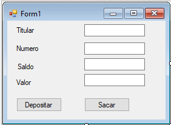

Mas e quando temos uma interface gráfica muito complexa? Nesses casos, podemos ter muitas funcionalidades ou informações dentro de uma única tela da aplicação. Para essa situação, é uma prática comum criar grupos de elementos com funcionalidades semelhantes. Para organizar os grupos de componentes de um formulário, no Windows Form possuímos mais um componente chamado `GroupBox`

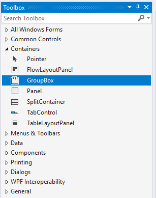

Utilizando o `GroupBox`, podemos agrupar diversos componentes diferentes sob um único título. O formulário do nosso projeto, por exemplo, ficaria da seguinte forma:

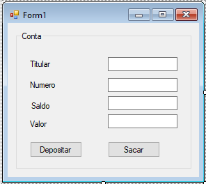

## Resumo dos atalhos do Visual Studio

Para facilitar a consulta dos atalhos do Visual Studio, nessa seção vamos listar os atalhos vistos no capítulo:


* **Ctrl + Shift + N**: cria um novo projeto dentro do Visual Studio;

* **Ctrl + .**: utilizado para fazer consertos rápidos no código. Quando estamos utilizando uma classe que não existe, ele declara a classe dentro do projeto. Ao utilizarmos uma propriedade ou método inexistente, o atalho cria automaticamente o código para a propriedade ou método;

* **Ctrl + R, Ctrl + R**: renomeia classes, métodos, propriedades, atributos ou variáveis utilizadas no código;

* **Ctrl + <espaço>**: autocomplete;

* **ctor + <tab> + <tab>**: declara um construtor dentro da classe;

* **prop + <tab> + <tab>**: declara uma propriedade dentro da classe;

* **mbox + <tab> + <tab>**: declara o código do MessageBox.Show().


## Exercícios
1. Monte um formulário que mostre os campos titular, saldo e numero de uma Conta. Faça com que a variável que guarda o campo titular seja chamada de `textoTitular`, a que guarda o saldo seja `textoSaldo` e a que guarda o numero seja `textoNumero`.

	No load do formulário, escreva um código que cria uma conta com titular Victor e numero 1. Mostre os dados dessa conta nos campos `textoTitular`, `textoSaldo` e `textoNumero` do formulário.

	
1. Crie um novo campo de texto no formulário chamado `textoValor`. Adicione também um novo botão que quando clicado executará a lógica de depósito utilizando o valor digitado no campo criado. Depois de executar a lógica, atualize o saldo atual que é exibido pelo formulário.

	
1. Coloque um novo botão no formulário. Faça com que a ação do clique desse botão execute um saque na conta usando o valor do campo `textoValor`. Após o saque, atualize as informações que são exibidas para o usuário.

	


## Para saber mais — tipos implícitos e a palavra VAR

Um cliente precisa ser maior de idade ou emancipado para abrir uma conta no banco. Além disso, ele também precisa de um CPF. Para verificar isso, o sistema possui um método que verifica se um cliente pode ou não abrir uma conta:

``` csharp
public bool PodeAbrirContaSozinho
{
    get
    {
        return (this.idade >= 18 || 
        this.documentos.contains("emancipacao")) && 
        !string.IsNullOrEmpty(this.cpf);
    }
}
```

Perceba que podemos criar três variáveis para que nosso `if` não fique muito complexo:

``` csharp
public bool PodeAbrirContaSozinho
{
    get
    {
        bool maiorDeIdade = this.idade >= 18;
        bool emancipado = this.documentos.contains("emancipacao");
        bool possuiCPF = !string.IsNullOrEmpty(this.cpf);
        return (maiorDeIdade || emancipado) && possuiCPF;
    }
}
```

Desse jeito, o código fica mais limpo e fácil de entender. Porém, tivemos que ficar declarando os tipos das variáveis como `bool`. Não seria óbvio para o C# que essas variáveis são do tipo `bool`. Sim! E ele é esperto o suficiente para **inferir** isso:

``` csharp
public bool PodeAbrirContaSozinho
{
    get
    {
        var maiorDeIdade = this.idade >= 18;
        var emancipado = this.documentos.contains("emancipacao");
        var possuiCPF = !string.IsNullOrEmpty(this.cpf);
        return (maiorDeIdade || emancipado) && possuiCPF;
    }
}
```

Variáveis **dentro de métodos** podem ser declaradas como `var` em C# que o seu tipo é inferido automaticamente. Para o compilador acertar qual o tipo da variável ela deve ser inicializada no mesmo instante que é declarada e não pode ser atribuído o valor `null`.

``` csharp
public bool PodeAbrirContaSozinho
{
    get
    {
        var maiorDeIdade; // esta linha não compila
        maiorDeIdade = this.idade >= 18;
        // ...
    }
}
```

Por fim, uma variável declarada como `var` possui um tipo bem definido e não pode ser alterado. A tipagem é inferida, mas o tipo da variável não pode ser alterada à medida que o código é executado, o que faz com que o código seguinte não faça sentido e não compile:

``` csharp
var guilherme = new Cliente();
guilherme = new Conta();
```

## Exercícios Opcionais
1. Observe o código a seguir e assinale a alternativa correta.

	``` csharp
 var conta = new Conta();
 conta.Titular = new Cliente();
	```

	* Não compila pois a variável é de um tipo dinâmico.

	* Compila e faz com que a variável `conta` possa referenciar qualquer tipo de objeto.

	* Não compila pois ele não tem como adivinhar se `var` é uma conta nova ou já existente.

	* Compila e faz com que a variável conta seja do tipo `Conta`.

	
1. O que acontece ao tentar compilar e rodar o código a seguir?

	``` csharp
 var simples = new Conta(); // linha 1
 simples = new Conta(); // linha 2
 simples = new Cliente(); // linha 3
	```

	* A linha 2 não compila pois não podemos reatribuir uma variável.

	* A linha 3 não compila pois o tipo de uma variável não pode ser trocado e ele é inferido ao declarar a variável.

	* Compila e no fim das 3 linhas de código a variável simples apontará para um `Cliente`.

	* A linha 1 não compila devido ao código da linha 2 e 3.

	
1. O que acontece ao compilar e rodar o código a seguir?

	``` csharp
 var conta;
 conta = new Conta();
 conta.Deposita(300);
	```

	* Não compila pois conta não teve um valor atribuído já na primeira linha.

	* Compila mas não roda, dando erro de execução na linha 2 pois tentamos acessar uma variável sem valor.

	* Compila e roda.

	
1. O que acontece ao compilar e executar o código adiante?

	``` csharp
 var tamanho = 5;
 tamanho = tamanho / 2.0;
 MessageBox.Show(tamanho);
	```

	* O código não compila na linha 2.

	* O código compila e roda imprimindo 2.

	* O código compila mas não roda pois 5 não é divisível por 2.0.

	* O código compila e roda, imprimindo tamanho = 2.5

	
