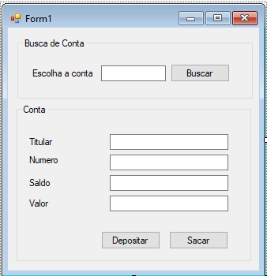
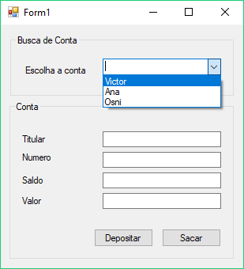
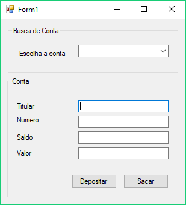

# Trabalhando com arrays


Queremos guardar uma lista de contas de nosso banco para poder trabalhar com elas. Uma primeira alternativa seria criar um conjunto de variáveis, no qual cada variável aponta para uma `Conta` diferente:

``` csharp
Conta c1 = new Conta();
Conta c2 = new ContaPoupanca();
Conta c3 = new Conta();
// ...
```

Mas, e se quisermos imprimir o saldo de todas elas? Precisaremos escrever N linhas, uma para cada `Conta`:

``` csharp
MessageBox.Show(c1.Titular.Nome);
MessageBox.Show(c2.Titular.Nome);
MessageBox.Show(c3.Titular.Nome);
```

Muito trabalho! Criar uma nova `Conta` seria um caos!

Quando queremos guardar diversos objetos, podemos fazer uso de **Arrays**. Um array é uma estrutura de dados que consegue guardar vários elementos e ainda nos possibilita pegar esses elementos de maneira fácil!

Criar um array é muito parecido com instanciar uma classe. Para criarmos 5 posições de números inteiros:

``` csharp
int[] numeros = new int[5];
```

Acabamos de declarar um array de inteiros, com 5 posições. Repare a notação `[5]`.
Para guardar elementos nessas posições, fazemos:

``` csharp
numeros[0] = 1;
numeros[1] = 600;
numeros[2] = 257;
numeros[3] = 12;
numeros[4] = 42;
MessageBox.Show("número = " + numeros[1]);
```

Veja que a primeira posição de um array é `0` (zero). Logo, as posições de um array vão de `0` (zero) até `(tamanho-1)`.

Vamos agora criar um array de `Conta`s:

``` csharp
Conta[] contas = new Conta[5];
contas[0] = new Conta();
```

A sintaxe é a mesma. Os elementos guardados pelo array são iguais aos de uma variável convencional,
que você já está acostumado. Isso quer dizer que temos polimorfismo também! Ou seja, podemos guardar,
em um array de `Conta`, qualquer filho dela:

``` csharp
contas[1] = new ContaPoupanca();
```

Se quisermos imprimir todas as Contas armazenadas, podemos fazer um loop nesse array. O loop começará
em `0` e vai até o tamanho do array (`contas.Length`):

``` csharp
for(int i = 0; i < contas.Length; i++) 
{
	MessageBox.Show("saldo = " + contas[i].Saldo);
}
```

Podemos ainda usar uma outra sintaxe do C#, afinal queremos ir `para cada Conta c em contas`:

``` csharp
foreach(Conta c in contas)
{
	MessageBox.Show("saldo = " + c.Saldo);
}
```

O C# pega cada elemento do array e coloca automaticamente na variável `c`, imprimindo o resultado que queremos.

## Para saber mais — inicialização de Arrays

Em muitas situações, estamos interessados em criar e logo em seguida inicializar o conteúdo de um array, para isso, como vimos nesse capítulo, precisaríamos de um código parecido com o que segue:

``` csharp
int[] inteiros = new int[5];
inteiros[0] = 1;
inteiros[1] = 2;
inteiros[2] = 3;
inteiros[3] = 4;
inteiros[4] = 5;
```

Veja que esse código é repetitivo e fácil de ser escrito de forma incorreta. Para facilitar nosso trabalho, o C# nos oferece um atalho para criar e inicializar o conteúdo do array. Se quiséssemos um array de inteiros preenchido com os números de 1 a 5, poderíamos utilizar o seguinte código:

``` csharp
int[] umAoCinco = new int[] { 1, 2, 3, 4, 5 };
```

Essa sintaxe pode ser utilizada em arrays de qualquer tipo.

## Exercícios


1. 
	Qual das linhas a seguir instancia um array de 10 elementos?

	* int[] numeros = new int[9];

	* int[] numeros = new int[10];

	* int[] numeros = new int["dez"];

	* int[10] numeros = new int[10];

	
1. Imagine o array abaixo:

	``` csharp
 int[] numeros = new int[15];
	```

	Como acessar o quinto elemento nessa lista?

	* numeros[3]

	* numeros[4]

	* numeros["quinto"]

	* numeros[5]

	
1. Dado um array `numero`, como descobrir seu tamanho?

	* numero.Length

	* numero.Size

	* numero.Size()

	* numero.Length()

	* numero.Capacity()

	
1. Agora vamos utilizar arrays no projeto do banco para trabalharmos com diversas contas ao mesmo tempo. Dentro da classe do formulário da aplicação, a classe `Form1` criada pelo Visual Studio, vamos guardar um array de `contas` ao invés de uma única `conta`.

	``` csharp
 public partial class Form1 : Form
 {
	// vamos substituir conta por um array de contas.
	// Apague a linha:
	// private Conta conta;
	// E coloque a declaração do array em seu lugar:
	private Conta[] contas;

	// resto da classe
 }
	```

	No método `Form1_Load`, vamos inicializar o array de contas do formulário e, ao invés de criarmos uma única conta, vamos criar diversas contas e guardá-las dentro do array.

	``` csharp
 private void Form1_Load(object sender, EventArgs e)
 {
	// criando o array para guardar as contas
	contas = new Conta[3];

	// vamos inicializar algumas instâncias de Conta.
	this.contas[0] = new Conta();
	this.contas[0].Titular = new Cliente("victor");
	this.contas[0].Numero = 1;

	this.contas[1] = new ContaPoupanca();
	this.contas[1].Titular = new Cliente("mauricio");
	this.contas[1].Numero = 2;

	this.contas[2] = new ContaCorrente();
	this.contas[2].Titular = new Cliente("osni");
	this.contas[2].Numero = 3;
 }
	```

	No formulário, para sabermos qual é a conta que deve ser exibida, colocaremos um novo campo de texto onde o usuário escolherá qual é o índice da `Conta` que será utilizada. Chame esse campo de texto de `textoIndice`. Além do campo de texto, adicione também um novo botão que quando clicado mostrará a conta do índice que o usuário selecionou.

	O seu formulário deve ficar parecido com o da imagem:

	

	Utilize `botaoBusca` como `(Name)` desse novo botão.

	Quando o usuário clicar no `botaoBusca`, precisamos mostrar a conta que foi selecionada:

	``` csharp
 private void botaoBusca_Click(object sender, EventArgs e)
 {
	int indice = Convert.ToInt32(textoIndice.Text);
    Conta selecionada = this.contas[indice];
    textoNumero.Text = Convert.ToString(selecionada.Numero);
    textoTitular.Text = selecionada.Titular.Nome;
    textoSaldo.Text = Convert.ToString(selecionada.Saldo);
 }
	```

	No botão de depósito, precisamos depositar o valor na conta que foi escolhida pelo usuário no `textoIndice`. Em nosso exemplo, se o usuário digitar `1` no `textoIndice`, precisamos fazer o depósito na conta do titular mauricio (que está na posição `1` do array).

	``` csharp
 private void botaoDeposito_Click(object sender, EventArgs e)
 {
    // primeiro precisamos recuperar o índice da conta selecionada
	int indice = Convert.ToInt32(textoIndice.Text);

	// e depois precisamos ler a posição correta do array.
    Conta selecionada = this.contas[indice];

    double valor = Convert.ToDouble(textoValor.Text);
    selecionada.Deposita(valor);
    textoSaldo.Text = Convert.ToString(selecionada.Saldo);
 }
	```

	Faça o mesmo para a ação do botão de Saque. Depois de fazer todas as modificações, teste a aplicação fazendo, por exemplo, um depósito na conta que está no índice `0`.

	Tente fazer operações em diferentes tipos de conta. Veja que dependendo do tipo de conta que foi cadastrada no array, teremos um resultado diferente para as operações de saque e depósito. Note que o código do formulário não precisa conhecer as contas que estão gravadas no array, ele precisa apenas utilizar os métodos que estão na interface de uso da conta.


## Organizando as contas com o ComboBox

Na aplicação, estamos gerenciando as contas cadastradas através de um campo de texto. Essa é uma abordagem bem simples, mas que possui diversos problemas:


* O código espera que o usuário digite um número no campo de texto. Se ele digitar uma letra ou qualquer outro caractere não numérico, teremos um erro;
* O número digitado deve ser um índice válido do array ou novamente teremos um erro no código.


Seria muito melhor se o usuário pudesse escolher uma conta cadastrada a partir de uma lista gerenciada pela aplicação. Para implementarmos essa ideia, vamos utilizar um novo componente do Windows Form chamado `ComboBox`.

Para adicionar um combo box no formulário, precisamos apenas abrir a janela `Toolbox` (`Ctrl+W, X`) e arrastar o combo box para dentro do formulário.


Para inserir os elementos que serão exibidos no combo box, precisaremos de uma variável que guarda a referência para o componente. Assim como no campo de texto, podemos definir o nome dessa variável através da janela `properties`.

Para acessar a janela `properties` do combo box, clique com o botão direito do mouse no combo box e selecione a opção `Properties`.

Dentro da janela `properties`, utilizaremos novamente o campo `(Name)` para definir o nome da variável que guardará a referência para o combo box. Vamos utilizar `comboContas`.

Agora precisamos mostrar os titulares das contas como itens do combo box. Para adicionar um novo item no combo box, utilizamos o seguinte código:

``` csharp
comboContas.Items.Add("Texto que aparecerá no combo box");
```

Logo, para mostrar os titulares como itens do combo box, utilizamos o seguinte código;

``` csharp
comboContas.Items.Add(contas[0].Titular.Nome);
comboContas.Items.Add(contas[1].Titular.Nome);
```

Ou podemos utilizar um `foreach`:

``` csharp
foreach(Conta conta in contas) 
{
	comboContas.Items.Add(conta.Titular.Nome);
}
```



Agora que já conseguimos mostrar o combo box, queremos que a escolha de uma opção no combo, faça com que o formulário mostre a conta do titular selecionado.

Para associar uma ação ao evento de mudança de seleção do combo, precisamos apenas dar um duplo clique no combo box. Isso criará um novo método na classe `Form1`:

``` csharp
private void comboContas_SelectedIndexChanged(object sender, EventArgs e)
{

}
```

Podemos recuperar qual é o índice (começando de zero) do item que foi selecionado pelo usuário lendo a propriedade `SelectedIndex` do `comboContas`:

``` csharp
int indice = comboContas.SelectedIndex;
```

Esse índice representa qual é o elemento do array de contas que foi selecionado, logo, podemos usá-lo para recuperar a conta que foi escolhida:

``` csharp
Conta selecionada = contas[indice];
```

Depois de descobrir qual é a conta escolhida, vamos mostrá-la no formulário:

``` csharp
textoTitular.Text = selecionada.Titular.Nome;
textoSaldo.Text = Convert.ToString(selecionada.Saldo);
textoNumero.Text = Convert.ToString(selecionada.Numero);
```

O código completo do `comboContas_SelectedIndexChanged` fica da seguinte forma:

``` csharp
private void comboContas_SelectedIndexChanged(object sender, EventArgs e)
{
	int indice = comboContas.SelectedIndex;
	Conta selecionada = contas[indice];
	textoTitular.Text = selecionada.Titular.Nome;
	textoSaldo.Text = Convert.ToString(selecionada.Saldo);
	textoNumero.Text = Convert.ToString(selecionada.Numero);
}
```


## Exercícios
1. Vamos substituir o campo de texto que seleciona a conta para as operações por um combo box. No formulário da aplicação apague o campo `textoIndice`, o `botaoBusca` e o método `botaoBusca_Click`. Esses dois componentes serão substituídos pelo combo box.

	Agora abra a janela Toolbox do Visual Studio e arraste um `ComboBox` para a aplicação. Chame componente de `comboContas`. Seu formulário deve ficar como o a seguir:

	

	Na ação de carregamento do formulário, vamos cadastrar as contas do array dentro do combo box. Para isso, precisamos chamar o método `Add` da propriedade `Items` do `comboContas` passando qual é o texto que queremos mostrar como opção do combo box.

	``` csharp
 private void Form1_Load(object sender, EventArgs e)
 {
	// código de inicialização do array de contas

	foreach(Conta conta in contas)
	{
		comboContas.Items.Add("titular: " + conta.Titular.Nome);
	}
 }
	```

	Quando o usuário modificar o valor do combo box, queremos mudar a conta que é exibida no formulário. Para criarmos o método que cuidará do evento de mudança de item selecionado do combo box, dê um duplo clique no componente. Isso criará dentro do `Form1` o método `comboContas_SelectedIndexChanged`:

	``` csharp
 private void comboContas_SelectedIndexChanged(object sender, EventArgs e)
 {
    int indice = comboContas.SelectedIndex;
    Conta selecionada = this.contas[indice];
    textoNumero.Text = Convert.ToString(selecionada.Numero);
    textoTitular.Text = selecionada.Titular.Nome;
    textoSaldo.Text = Convert.ToString(selecionada.Saldo);
 }
	```

	Agora faça com que os botões Depositar e Sacar (métodos `botaoDeposito_Click` e `botaoSaque_Click`, respectivamente) operem na conta selecionada pelo combo box.
1. (Opcional) Vamos agora adicionar a lógica de transferência no formulário. Adicione um novo combo box no formulário chamado `comboDestinoTransferencia` e um novo botão que, quando clicado, transfere dinheiro da conta selecionada no `comboContas` para a conta selecionada no `comboDestinoTransferencia`.
	
