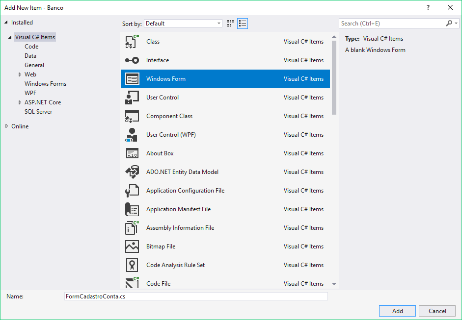
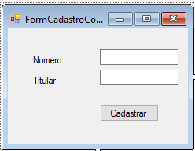

# Cadastro de novas contas

Até agora, temos em nossa aplicação um caixa eletrônico com um número fixo de contas, nesse capítulo, vamos fazer um novo formulário para cadastrar as contas no caixa eletrônico.

Para não colocarmos ainda mais campos no formulário principal, vamos criar um novo formulário no projeto. Abra o `Solution Explorer`, clique com o botão direito no projeto `Banco` e selecione `Add > New Item`.


Na nova janela, selecione a opção `Windows Form` e coloque `FormCadastroConta.cs` no campo `Name`. Em seguida, clique no botão `Add`.



Agora que terminamos de criar o novo formulário, vamos adicionar um campo de texto para o titular da conta (chamado `textoTitular`) e um para o número da conta (chamado `textoNumero`). Além desses campos, precisaremos também de um botão que, quando clicado, realizará o cadastro da nova conta. Adicione o botão e chame-o de `botaoCadastro`



Vamos definir a ação do botão de cadastro desse novo formulário. Dê um duplo clique no botão que acabamos de criar. Isso abrirá novamente o editor do Visual Studio:

``` csharp
public partial class FormCadastroConta : Form
{
    public FormCadastroConta()
    {
        InitializeComponent();
    }
    
    private void botaoCadastro_Click(object sender, EventArgs e)
    {
    
    }
}
```

Na ação do botão, queremos criar uma nova instância de conta, `ContaCorrente` por exemplo, e depois preencher os seus dados:

``` csharp
private void botaoCadastro_Click(object sender, EventArgs e)
{
    Conta novaConta = new ContaCorrente();
    novaConta.Titular = new Cliente(textoTitular.Text);
    novaConta.Numero = Convert.ToInt32(textoNumero.Text);
}
```

Agora que inicializamos a conta, precisamos cadastrá-la no array que está na classe `Form1`. Precisamos, portanto, acessar a instância de `Form1` a partir de `FormCadastroConta`. Queremos garantir que, na construção do `FormCadastroConta`, teremos a instância de `Form1`, portanto vamos modificar o construtor da classe para receber o formulário principal:

``` csharp
public partial class FormCadastroConta : Form 
{
	private Form1 formPrincipal;

	public FormCadastroConta(Form1 formPrincipal) {
		this.formPrincipal = formPrincipal;
		InitializeComponent();
	}

	// Ação de cadastro de conta
}
```

Precisamos colocar a conta criada no array que contém todas as contas cadastradas que está no formulário principal da aplicação.

Para fazer isso, podemos mudar a visibilidade do atributo (deixar o contas público), mas isso é uma violação de encapsulamento, estamos claramente vendo os detalhes de implementação da classe `Form1`. Portanto, precisamos colocar um método que adiciona uma nova conta na interface de uso da classe `Form1`.

``` csharp
public partial class Form1 
{
	// Esse é o mesmo array que colocamos no capítulo de arrays.
	private Conta[] contas;
	
	// outros métodos de Form1

	public void AdicionaConta(Conta conta) {
	    // implementação do método adiciona conta
	}
}
```

Inicialmente, temos zero contas cadastradas no sistema e a primeira conta será colocada na posição zero, no cadastro da segunda, temos 1 conta já cadastrada e a próxima será colocada na posição 1. Repare que sempre colocamos a conta na posição equivalente ao número de contas que já estão cadastradas. Então para implementarmos o `AdicionaConta`, precisaremos de um novo atributo no formulário que representa o número de contas que já foram cadastradas.

``` csharp
public partial class Form1 
{
	private Conta[] contas;
	// guarda o número de contas que já foram cadastradas
	private int numeroDeContas;
	
	// outros métodos de Form1

	public void AdicionaConta(Conta conta) {
        this.contas[this.numeroDeContas] = conta;
        this.numeroDeContas++;
	}
}
```

Além de colocar a conta no array, precisamos também registrar a conta no `comboContas`.

``` csharp
public void AdicionaConta(Conta conta) {
	this.contas[this.numeroDeContas] = conta;
	this.numeroDeContas++;
	comboContas.Items.Add("titular: " + conta.Titular.Nome);
}
```

Precisamos utilizar esse novo método dentro do formulário de cadastro para cadastrar a nova conta:

``` csharp
private void botaoCadastro_Click(object sender, EventArgs e)
{
    Conta novaConta = new ContaCorrente();
    novaConta.Titular = new Cliente(textoTitular.Text);
    novaConta.Numero = Convert.ToInt32(textoNumero.Text);
    
    this.formPrincipal.AdicionaConta(novaConta);
}
```

Agora que temos toda a lógica pronta, precisamos apenas colocar um botão no formulário principal que abre o formulário de cadastro de nova conta. Chamá-lo-emos de `botaoNovaConta`:


Na ação desse botão, precisamos instanciar o `FormCadastroConta` passando a instância do formulário principal. Dê um duplo clique no botão que acabamos de incluir no formulário para implementar sua ação:

``` csharp
private void botaoNovaConta_Click(object sender, EventArgs e)
{
    // this representa a instância de Form1 que está sendo utilizada pelo
    // Windows Form
    FormCadastroConta formularioDeCadastro = new FormCadastroConta(this);
}
```

Para mostrar o formulário, utilizaremos o método `ShowDialog` do `FormCadastroConta`

``` csharp
private void botaoNovaConta_Click(object sender, EventArgs e)
{
    FormCadastroConta formularioDeCadastro = new FormCadastroConta(this);
    formularioDeCadastro.ShowDialog();
}
```

Com isso terminamos o cadastro de novas contas na aplicação.

## Utilizando o AdicionaConta no load do formulário

Temos o seguinte código no método que é executado no Load do formulário principal:

``` csharp
private void Form1_Load(object sender, EventArgs e)
{
    this.contas = new Conta[3];

	// vamos inicializar algumas instâncias de Conta.
	this.contas[0] = new Conta();
	this.contas[0].Titular = new Cliente("victor");
	this.contas[0].Numero = 1;

	this.contas[1] = new ContaPoupanca();
	this.contas[1].Titular = new Cliente("mauricio");
	this.contas[1].Numero = 2;

	this.contas[2] = new ContaCorrente();
	this.contas[2].Titular = new Cliente("osni");
	this.contas[2].Numero = 3;
	
	foreach(Conta conta in contas)
	{
	    comboContas.Items.Add(c.Titular.Nome);
	}
}
```

Veja que estamos colocando as contas diretamente na posição correta do array, mas não estamos atualizando o atributo `numeroDeContas` que incluímos no formulário. Além disso, inicializamos o array com apenas 3 posições, logo não temos mais espaço para cadastrar as novas contas.

Para resolver o segundo problema, precisamos simplesmente modificar o tamanho do array que é alocado para, por exemplo, aceitar até dez contas:

``` csharp
private void Form1_Load(object sender, EventArgs e)
{
    this.contas = new Conta[10];

    // resto do código do método
}
```

Para resolver o primeiro problema, o de atualizar o valor do atributo `numeroDeContas`, precisamos apenas de um incremento depois de adicionar cada uma das contas no array:

``` csharp
private void Form1_Load(object sender, EventArgs e)
{
    this.contas = new Conta[10];

	// vamos inicializar algumas instâncias de Conta.
	this.contas[0] = new Conta();
	this.contas[0].Titular = new Cliente("victor");
	this.contas[0].Numero = 1;
	this.numeroDeContas++;

	this.contas[1] = new ContaPoupanca();
	this.contas[1].Titular = new Cliente("mauricio");
	this.contas[1].Numero = 2;
	this.numeroDeContas++;

	this.contas[2] = new ContaCorrente();
	this.contas[2].Titular = new Cliente("osni");
	this.contas[2].Numero = 3;
	this.numeroDeContas++;
	
	foreach(Conta conta in contas)
	{
	    comboContas.Items.Add(c.Titular.Nome);
	}
}
```

Veja que no código do método estamos cadastrando a conta no array, incrementando o número de contas e, por fim, adicionando a conta no `comboContas`. Esse código faz exatamente o mesmo trabalho que o método `AdicionaConta` que criamos nesse capítulo. Então, podemos reutilizá-lo:

``` csharp
private void Form1_Load(object sender, EventArgs e)
{
    this.contas = new Conta[10];

	// vamos inicializar algumas instâncias de Conta.
	Conta c1 = new Conta();
	c1.Titular = new Cliente("victor")
	c1.Numero = 1;
	this.AdicionaConta(c1);

    Conta c2 = new ContaPoupanca();
    c2.Titular = new Cliente("mauricio");
	c2.Numero = 2;
    this.AdicionaConta(c2);

	Conta c3 = new ContaCorrente();
	c3.Titular = new Cliente("osni");
	c3.Numero = 3;
	this.AdicionaConta(c3);
}
```

Repare que com esse código o método `Form1_Load` não precisa mais se preocupar com os detalhes de como as contas são armazenadas e nem de como adicionar a conta no `comboContas`. Todo esse conhecimento fica encapsulado no método `AdicionaConta`.

## Exercícios
1. Vamos criar um novo formulário que será responsável por fazer o cadastro de novas contas na aplicação. Na janela do Solution Explorer, clique com o botão direito no nome do projeto e escolha a opção `Add > New Item`.

	Na janela de novo item, escolha a opção `Windows Form` e utilize `FormCadastroConta` como nome do novo formulário que será criado. Dentro desse formulário, coloque dois campos de texto, um chamado `textoNumero` e outro chamado `textoTitular`. Além disso, adicione também um novo botão nesse formulário. Esse será o botão que cadastrará a nova conta. Chame o botão de `botaoCadastro`.
1. Vamos agora implementar a ação do botão de cadastro desse novo formulário (o `FormCadastroConta`). Dê um duplo clique no botão que acabamos de adicionar. Dentro da ação do botão, leia as informações que foram digitadas no formulário e utilize-as para criar uma nova `ContaCorrente`:

	``` csharp
 private void botaoCadastro_Click(object sender, EventArgs e)
 {
    ContaCorrente novaConta = new ContaCorrente();
    novaConta.Titular = new Cliente(textoTitular.Text);
    novaConta.Numero = Convert.ToInt32(textoNumero.Text);
 }
	```

	Agora localize o construtor do  `FormCadastroConta`:

	``` csharp
 public FormCadastroConta()
 {
    InitializeComponent();
 }
	```

	Faça com que esse construtor receba um argumento do tipo `Form1` chamado `formPrincipal`. Guarde o valor que foi passado dentro de um novo atributo. Seu código deve ficar parecido com o que segue:

	``` csharp
 public partial class FormCadastroConta : Form 
 {
    private Form1 formPrincipal;

    public FormCadastroConta(Form1 formPrincipal)
    {
        this.formPrincipal = formPrincipal;
        InitializeComponent();
    }

    private void botaoCadastro_Click(object sender, EventArgs e)
    {
        ContaCorrente novaConta = new ContaCorrente();
        novaConta.Titular = new Cliente(textoTitular.Text);
        novaConta.Numero = Convert.ToInt32(textoNumero.Text);
    }
 }
	```
1. Dentro da classe do formulário principal, arquivo `Form1.cs`, adicione um novo atributo chamado `numeroDeContas` e um novo método chamado `AdicionaConta` que receberá uma conta como argumento e a cadastrará no array de contas do formulário:

	``` csharp
 public partial class Form1 : Form
 {
    private int numeroDeContas;

    // Esse array já estava declarado na classe
    private Conta[] contas;

    // implementação das ações do formulário

    public void AdicionaConta(Conta conta)
    {
        this.contas[this.numeroDeContas] = conta;
        this.numeroDeContas++;
        comboContas.Items.Add("titular: " + conta.Titular.Nome);
    }
 }
	```
1. Abra novamente o código do botão do formulário de cadastro de novas contas. Dentro do método `botaoCadastro_Click`, utilize o `AdicionaConta` do `formPrincipal` passando a conta que foi criada anteriormente.

	``` csharp
 private void botaoCadastro_Click(object sender, EventArgs e)
 {
    ContaCorrente novaConta = new ContaCorrente();
    novaConta.Titular = new Cliente(textoTitular.Text);
    novaConta.Numero = Convert.ToInt32(textoNumero.Text);

    this.formPrincipal.AdicionaConta(novaConta);
 }
	```
1. Dentro do formulário principal da aplicação (`Form1.cs`), coloque um novo botão que quando clicado mostrará o formulário de cadastro. Chame esse novo botão `botaoNovaConta`.

	``` csharp
 private void botaoNovaConta_Click(object sender, EventArgs e)
 {
    FormCadastroConta formularioCadastro = new FormCadastroConta(this);
    formularioCadastro.ShowDialog();
 }
	```
1. Antes de testar o cadastro de contas que acabamos de implementar, abra o método `Form1_Load` do formulário principal e cadastre as contas padrão do sistema utilizando o método `AdicionaConta` que criamos em um exercício anterior:

	``` csharp
 private void Form1_Load(object sender, EventArgs e)
 {
    this.contas = new Conta[10];

	// vamos inicializar algumas instâncias de Conta.
	Conta c1 = new Conta();
	c1.Titular = new Cliente("victor")
	c1.Numero = 1;
	this.AdicionaConta(c1);

    Conta c2 = new ContaPoupanca();
    c2.Titular = new Cliente("mauricio");
	c2.Numero = 2;
    this.AdicionaConta(c2);

	Conta c3 = new ContaCorrente();
	c3.Titular = new Cliente("osni");
	c3.Numero = 3;
	this.AdicionaConta(c3);
 }
	```

	Depois de fazer essa modificação final, execute a aplicação e teste o cadastro.
1. (Opcional) No formulário de cadastro, adicione um combo box (chamado `comboTipoConta`) que permita a escolha do tipo de conta que será cadastrado.

	
1. (Desafio) No projeto estamos atualmente utilizando um array de contas com um tamanho fixo e por isso só podemos cadastrar um número limitado de contas. Modifique o método `AdicionaConta` da classe `Form1` para que ele aceite um número ilimitado de contas.

	
