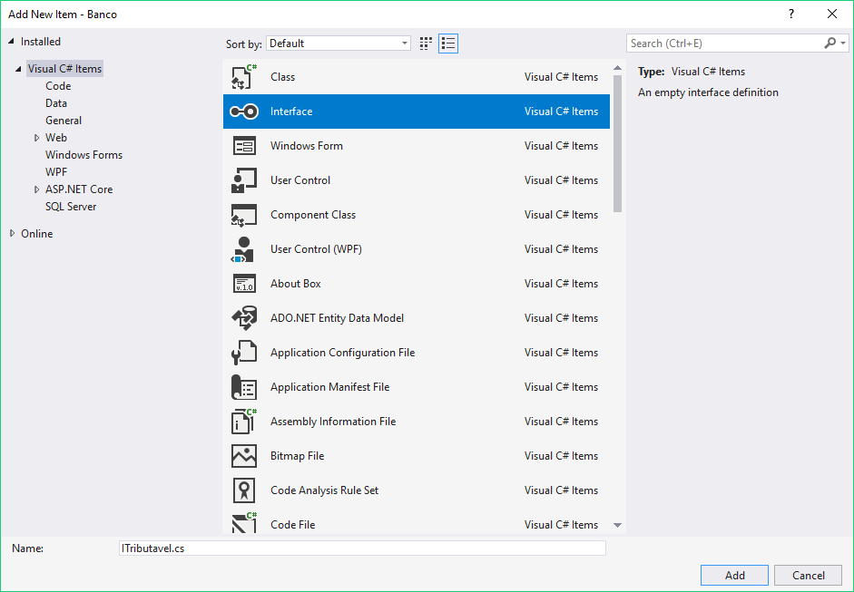

# Interfaces


Nosso banco agora suporta Contas de Investimento. Já sabemos como fazer: basta herdar da classe `Conta`:

``` csharp
public class ContaInvestimento : Conta
{
  // comportamentos específicos da conta investimento
}
```

Por lei, uma vez por ano devemos pagar um tributo ao governo relacionado às contas de investimento e contas de poupança. O mesmo não acontece com uma simples Conta Corrente.

Para resolver esse problema, podemos criar um método em ambas as classes que calcula o valor desse tributo. Por exemplo:

``` csharp
public class ContaPoupanca : Conta 
{
  // outros metodos

  public double CalculaTributo() {
    return this.Saldo * 0.02;
  }
}
public class ContaInvestimento : Conta 
{
  // outros metodos

  public double CalculaTributo() {
    return this.Saldo * 0.03;
  }
}
```

Excelente. Os métodos só ficam nas Contas que realmente sofrem esse tributo.

Agora, a próxima funcionalidade é a geração de um relatório, no qual devemos imprimir a quantidade total de tributos pagos por todas as Contas Investimento ou Poupanca do nosso banco. Precisamos de uma classe que acumula o valor de todos os tributos de todas as contas do banco. Esse é um problema parecido com o que já tivemos antes:

``` csharp
public class TotalizadorDeTributos {
  public double Total { get; private set; }

  public void Acumula(ContaPoupanca cp) {
    Total += cp.CalculaTributo();
  }

  public void Acumula(ContaInvestimento ci) {
    Total += ci.CalculaTributo();
  }
}
```

Pronto. Agora basta passarmos `ContaInvestimento` ou `ContaPoupanca` e nossa classe acumulará o valor do tributo. Repare que toda vez que uma nova conta sofrer um tributo, precisaremos lembrar de voltar na classe `TotalizadorDeTributos` e criar um novo método `Acumula()`.

Nos capítulos anteriores, resolvemos isso usando polimorfismo. Se a classe pai possuir o método em comum, então basta recebermos uma referência pro tipo pai:

``` csharp
public class TotalizadorDeTributos {
  public double Total { get; private set; }

  public void Acumula(Conta c) {
    Total += c.CalculaTributo();
  }
}
```

Mas será que faz sentido colocar o método `CalculaTributo()` na classe `Conta`?

``` csharp
public abstract class Conta {
  // resto da classe aqui
  public abstract double CalculaTributo();
}
```

Nem todas as Contas são tributáveis. Se fizermos isso, a classe `ContaCorrente` ganhará esse método, mas ela não sofre tributo!

Precisamos achar uma maneira de "achar um pai em comum" apenas para a `ContaCorrente` e `ContaInvestimento`. Classes em C# não podem ter dois pais. Mas o que podemos fazer é dizer para o compilador que garantiremos a existência do método `CalculaTributo()` nas classes que chegarem para o método `Acumula()`.

Como fazemos isso? Simples. Fazemos a classe "assinar" um contrato! Nesse caso, queremos assinar o contrato que fala que somos Tributáveis. Contratos no C# são conhecidos como interfaces. A declaração de uma interface é praticamente igual a de uma classe, porém utilizamos a palavra `interface` ao invés de `class`.

``` csharp
public interface Tributavel
{
    // código da interface
}
```

A convenção de nomes do C# para uma interface é seguir a mesma convenção de nomenclatura de classes porém com um `I` no começo do nome:

``` csharp
public interface ITributavel 
{
    
}
```

É uma boa prática colocar o código da interface dentro de um arquivo separado com o mesmo nome da interface. Por exemplo, a interface `ITributavel` ficaria no arquivo `ITributavel.cs`. Dentro da interface, queremos colocar a declaração do método `CalculaTributo()`. Métodos declarados em uma interface nunca possuem implementação e sempre são públicos. A declaração da interface `ITributavel` com o método `CalculaTributo()` fica da seguinte forma:

``` csharp
// Arquivo ITributavel.cs

public interface ITributavel
{
    double CalculaTributo();
}
```

Queremos fazer com que a conta poupança assine o contrato `ITributavel` que acabamos de criar, para isso, precisamos colocar o nome da interface que queremos implementar logo após a declaração da classe pai:

``` csharp
// Arquivo ContaPoupanca.cs

public class ContaPoupanca : Conta, ITributavel
{
    // Implementação dos métodos da ContaPoupanca
}
```

Como a interface `ITributavel` declara o método `CalculaTributo()`, toda classe que assina a interface é obrigada a dar uma implementação para essa funcionalidade, se não implementarmos o método da interface, a classe não compilará.

``` csharp
public class ContaPoupanca : Conta, ITributavel
{
  // resto da classe aqui
  
  // método que sou obrigado a implementar
  public double CalculaTributo()
  {
    return this.Saldo * 0.02;
  }
}
```

Repare que, para implementarmos o método da interface, não podemos utilizar a palavra `override`, ela é reservada para a sobrescrita de métodos da Herança. A mesma coisa para a `ContaInvestimento`:

``` csharp
public class ContaInvestimento : Conta, ITributavel
{
  // resto da classe aqui
  
  // método que sou obrigado a implementar
  public double CalculaTributo()
  {
    return this.Saldo * 0.03;
  }
}
```

Além disso, podemos fazer com que uma classe assine uma interface sem herdar de outra classe. Por exemplo, o banco também trabalha com seguros de vida que também são tributáveis, logo podemos representar essa classe com o seguinte código:

``` csharp
public class SeguroDeVida : ITributavel
{
    public double CalculaTributo()
    {
        // implementação do CalculaTributo
    }
}
```

Dessa forma, podemos dizer que a classe `TotalizadorDeTributos` recebe um `ITributavel` qualquer. O polimorfismo funciona com interfaces!

``` csharp
public class TotalizadorDeTributos {
  public double Total { get; private set; }

  public void Acumula(ITributavel t) {
    Total += t.CalculaTributo();
  }
}
```

Excelente! Veja que com interfaces conseguimos fazer com que um conjunto de classes implemente os mesmos métodos.

Interfaces são bem mais simples do que classes. Elas não tem atributos e seus métodos não tem implementação. A interface apenas nos garante que o método existirá naquela classe. Por esse motivo, apesar de C# não suportar herança múltipla (ser filho de mais de uma classe), podemos implementar quantas interfaces quisermos. Basta colocar uma na frente da outra:

``` csharp
public class ContaInvestimento : Conta, ITributavel, OutraInterfaceQualquer
{
  // implementa os métodos das interfaces Tributavel e OutraInterfaceQualquer
}
```

Quando uma classe utiliza tanto herança quanto interfaces, precisamos sempre declarar qual é a classe pai e depois as interfaces, assim como fizemos na `ContaPoupanca`:

``` csharp
// Repare que primeiro colocamos a classe pai (Conta) e depois as interfaces. 
// Se mudarmos a ordem, o código não compilará.
public class ContaPoupanca : Conta, ITributavel
{
    // implementação
}
```

Acostume-se com interfaces. Daqui pra frente, veremos as várias interfaces que existem no C#!

## Exercícios
1. O banco precisa gerenciar os impostos que serão pagos por seus produtos. Para resolver esse problema,
	criaremos uma nova interface chamada `ITributavel`. Para criar a interface, clique com o botão direito
	do mouse no nome do projeto e escolha a opção `Add > New Item` (o mesmo que utilizamos para criar o
	formulário de cadastro). Na janela de novo item, escolha a opção `Interface` e coloque o nome
	`ITributavel`:

	

	Faça com que essa interface declare um método chamado `CalculaTributos` que não recebe nenhum argumento
	e devolve um `double` que representa o valor do imposto que deve ser pago.

	O código da interface deve ficar parecido com o seguinte:

	``` csharp
 public interface ITributavel
 {
    double CalculaTributos();
 }
	```
1. O que acontece se tentarmos instanciar uma interface?

	``` csharp
 ITributavel t = new ITributavel();
	```

	* Erro de compilação. Interfaces não tem implementação e, logo, não podem ser instanciadas.

	* O código compila, mas o objeto não faz nada.

	* O C# busca aleatoriamente uma classe que implementa essa interface e a instancia.

	
1. Faça com que a classe `ContaCorrente` implemente a interface `ITributavel` que acabamos de criar,
	porém ainda não implemente o método `CalculaTributos`. Tente executar o código. O que aconteceu?
1. Como a `ContaCorrente` assina a interface `ITributavel`, precisamos colocar uma implementação
	para o método `CalculaTributos` dentro da classe, se não o código do projeto não compilará.
	Implemente o método `CalculaTributos` da `ContaCorrente`, faça com que a `ContaCorrente`
	pague 5% de seu saldo como imposto.
1. Crie uma nova classe no banco chamada `SeguroDeVida` e faça com que essa classe implemente
	a interface `ITributavel`. O método `CalculaTributos` do `SeguroDeVida` deve devolver
	um valor constante de 42 reais.
1. Agora vamos adicionar um novo botão no formulário que calculará os impostos do banco.
	Chame-o de `botaoImpostos`. No código desse botão, teste o método
	`CalculaTributos` em diferentes situações, por exemplo:

	``` csharp
 private void botaoImpostos_Click(object sender, EventArgs e)
 {
    ContaCorrente conta = new ContaCorrente();
    conta.Deposita(200.0);

    MessageBox.Show("imposto da conta corrente = " + conta.CalculaTributos());
    ITributavel t = conta;

    MessageBox.Show("imposto da conta pela interface = " + t.CalculaTributos());

    SeguroDeVida sv = new SeguroDeVida();
    MessageBox.Show("imposto do seguro = " + sv.CalculaTributos());

    t = sv;
    MessageBox.Show("imposto do seguro pela interface" + t.CalculaTributos());
 }
	```

	Depois de implementar seus testes, tente clicar no botão para ver o que acontece.
1. (Opcional) Crie uma nova classe chamada `TotalizadorDeTributos`, que será responsável
	por acumular os impostos de diferentes produtos tributáveis do banco:

	``` csharp
 public class TotalizadorDeTributos
 {
    public double Total { get; private set; }

    public void Adiciona(ITributavel t) 
    {
        this.Total += t.CalculaTributos();
    }
 }
	```

	Depois de criar essa classe, modifique o código do botão do exercício passado para que
	ele utilize a classe que acabamos de criar para calcular o total de impostos. Por exemplo:

	``` csharp
 private void botaoImpostos_Click(object sender, EventArgs e)
 {
    ContaCorrente conta = new ContaCorrente();
    conta.Deposita(200.0);

    SeguroDeVida sv = new SeguroDeVida();

    TotalizadorDeTributos totalizador = new TotalizadorDeTributos();
    totalizador.Adiciona(conta);
    MessageBox.Show("Total: " + totalizador.Total);
    totalizador.Adiciona(sv);
    MessageBox.Show("Total: " + totalizador.Total);
 }
	```
	
1. (Desafio) Pesquise sobre a palavra **is** do C# no seguinte link
	http://msdn.microsoft.com/en-us/library/scekt9xw.aspx e depois tente modificar o código
	o botão para que ele seja capaz de calcular automaticamente o imposto de todas as contas
	correntes que estão cadastradas no array de contas da aplicação.
