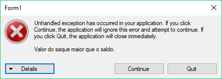

# Exceções

Voltando à nossa classe `ContaPoupanca`, um dos seus métodos é o `Saca`. Se tentarmos sacar um valor superior ao saldo do cliente, o método não permitirá o saque. Contudo, quem chamou o método não saberá se o saque foi realizado ou não. Como notificar quem invocou o método que o saque foi feito com sucesso ou não?

## Retorno do método para controlar erros

Uma primeira solução seria alterar o método `Saca` para retornar um booleano indicando se o saque foi ou não efetuado:

``` csharp
public class ContaPoupanca : Conta
{
    public override bool Saca(double valor)
    {
        if (valor + 0.10 <= this.Saldo)
        {
            this.Saldo -= valor + 0.10;
            return true;
        }
        else
        {
            return false;
        }
    }
    // Resto do código da classe
}
```

Assim, podemos saber se o saque foi efetuado ao chamar o método:

``` csharp
Conta conta = new ContaPoupanca();
// Inicializa a conta
if (conta.Saca(100.0))
{
    MessageBox.Show("Saque efetuado");
}
```

Essa abordagem é importante, por exemplo, no caso de um caixa eletrônico. Nós precisamos saber se o saque foi efetuado ou não antes de liberarmos o dinheiro para o cliente. Contudo, uma desvantagem dessa abordagem é que, se esquecermos de testar o retorno do método `Saca`, podemos liberar dinheiro para o cliente sem permissão.

E mesmo invocando o método e tratando o seu retorno de maneira adequada, o que faríamos se fosse necessário sinalizar exatamente qual foi o tipo de erro que aconteceu, como quando o usuário passou um valor negativo como quantidade?

Uma solução seria alterar o retorno de boolean para número inteiro e retornar o código do erro que ocorreu. Isso é considerado uma má prática, pois o valor devolvido é "mágico" e só legível perante extensa documentação (magic numbers), além de não obrigar o programador a tratar esse retorno, o que pode levar o programa a continuar executando em um estado inconsistente.

Um outro problema aconteceria se o método já retornasse algum valor. Desse jeito, não daria para alterar o retorno para indicar se o saque foi realizado ou não.

## Controlando erros com exceções

Para evitar esses problemas, o C# nos permite tratar essas exceções à regra de uma maneira diferente: através de **exceptions**. Em vez de retornarmos um valor dizendo se uma operação foi bem sucedida, nós lançamos uma exceção à regra padrão, ao comportamento padrão, dizendo que algo de errado aconteceu. No nosso caso, utilizaremos a exceção `Exception`, indicando que houve um erro na operação de saque:

``` csharp
public class ContaPoupanca : Conta
{
    public override void Saca (double valor)
    {
        if (valor + 0.10 > this.Saldo)
        {
            throw new Exception("Valor do saque maior que o saldo");
        }
        else
        {
            this.Saldo -= valor + 0.10;
        }
    }
}
```

Até o momento, aprendemos como lançar uma exception quando algum comportamento ocorreu de forma fora do comum. Mas, o que essa exception influencia na classe que o chamou? Por exemplo, vamos ver o que acontece quando tentamos sacar um valor superior ao saldo do cliente. Rode a sua aplicação com `F5` e tente sacar um valor superior ao saldo de um cliente.

Ao clicar no botão de saque, a execução do código será interrompida na linha em que a exceção é lançada. Isso ocorre porque o F5 roda o nosso programa em modo debug. Se rodarmos o programa fora do modo debug com `Ctrl+F5`, como se fosse um usuário rodando o programa, veríamos uma janela dizendo que ocorreu um erro:



Mas, nós não queremos que o usuário receba tal mensagem na tela. Então, não podemos chamar diretamente um método que pode lançar uma exceção. Ao invés disso, devemos tentar chamar o método: se não for lançada nenhuma exceção, ok; caso contrário, devemos pegar a exceção e executar um trecho de código referente à exceção.

Para tentar executar um trecho de código que pode lançar uma exceção, devemos colocá-lo dentro de um bloco **try**. No nosso caso, colocaremos dentro do bloco que trata o clique do botão saque:

``` csharp
private void botaoSaque_Click(object sender, EventArgs e)
{
    int indice = comboContas.SelectedIndex;
    double valor = Convert.ToDouble(textoValor.Text);
    Conta selecionada = this.contas[indice];
    try
    {
        selecionada.Saca(valor);
        textoSaldo.Text = Convert.ToString(selecionada.Saldo);
        MessageBox.Show("Dinheiro Liberado");
    }
}
```

E para pegar a exceção caso seja lançada e tratá-la, devemos pôr o código dentro de um block **catch**:

``` csharp
private void botaoSaque_Click(object sender, EventArgs e)
{
    int indice = comboContas.SelectedIndex;
    double valor = Convert.ToDouble(textoValor.Text);
    Conta selecionada = this.contas[indice];
    try
    {
        selecionada.Saca(valor);
        textoSaldo.Text = Convert.ToString(selecionada.Saldo);
        MessageBox.Show("Dinheiro Liberado");
    }
    catch (Exception ex)
    {
        MessageBox.Show("Saldo insuficiente");
    }
}
```

Nesse bloco, caso o método `Saca` lance uma exceção, o bloco catch será executado mostrando a mensagem `Saldo Insuficiente`. No caso de uma exceção, a mensagem `Dinheiro Liberado` não é exibida.

## Tratando múltiplas exceções

Uma outra situação exceptional ocorre quando o usuário da classe `Conta` tenta sacar um valor negativo, claramente um valor inválido para o saque. Nesse caso também queremos lançar uma exceção:

``` csharp
public override void Saca (double valor)
{
	if(valor < 0.0) 
	{
		throw new Exception();
	}
    if (valor + 0.10 > this.Saldo)
    {
        throw new Exception("Valor do saque maior que o saldo");
    }
    else
    {
        this.Saldo -= valor + 0.10;
    }
}
```

Quando passamos um valor negativo para o método `Saca`, o método lançará uma `Exception`, portanto o código do bloco `catch` do caixa eletrônico será executado para tratar a exceção gerada, exibindo para o usuário a mensagem `Saldo Insuficiente`. Porém essa mensagem está claramente errada.

Repare que, para jogarmos a exceção, precisamos executar um `new`, ou seja, a `Exception` é uma classe do C#! Podemos criar uma hierarquia de exceções utilizando a herança para indicar qual foi o tipo de erro que ocorreu.

Para criarmos um novo tipo de exceção, precisamos apenas criar uma nova classe que herde de `Exception`. Vamos criar uma exceção que indica que ocorreu um erro por saldo insuficiente na conta, a `SaldoInsuficienteException`:

``` csharp
public class SaldoInsuficienteException : Exception
{
}
```

E vamos utilizar o `SaldoInsuficienteException` no método `Saca` da classe `ContaPoupanca`:

``` csharp
public override void Saca (double valor)
{
	if(valor < 0.0) 
	{
		throw new Exception();
	}
    if (valor + 0.10 > this.Saldo)
    {
        throw new SaldoInsuficienteException();
    }
    else
    {
        this.Saldo -= valor + 0.10;
    }
}
```

Quando o usuário passa um argumento negativo ainda lançamos uma exceção genérica. Podemos criar um novo tipo de exceção que indica que o argumento passado é inválido. Porém, o C# já possui um conjunto de exceções padrão na linguagem (http://msdn.microsoft.com/pt-br/library/system.exception.aspx#inheritanceContinued). Dentre essas exceções, existe a `ArgumentException`, que indica que o argumento de um método é inválido. Vamos utilizar essa exceção no nosso código:

``` csharp
public override void Saca (double valor)
{
	if(valor < 0.0) 
	{
		throw new ArgumentException();
	}
    if (valor + 0.10 > this.Saldo)
    {
        throw new SaldoInsuficienteException();
    }
    else
    {
        this.Saldo -= valor + 0.10;
    }
}
```

Agora o código do caixa eletrônico pode tratar de forma diferente cada um dos tipos de exceção:

``` csharp
private void botaoSaque_Click(object sender, EventArgs e)
{
    int indice = comboContas.SelectedIndex;
    double valor = Convert.ToDouble(textoValor.Text);
    Conta selecionada = this.contas[indice];
    try
    {
        selecionada.Saca(valor);
        textoSaldo.Text = Convert.ToString(selecionada.Saldo);
        MessageBox.Show("Dinheiro Liberado");
    }
    catch (SaldoInsuficienteException ex)
    {
        MessageBox.Show("Saldo insuficiente");
    }
	catch (ArgumentException ex) 
	{
		MessageBox.Show("Não é possível sacar um valor negativo");
	}
}
```

Mas o que deve ser colocado dentro de um bloco `try`? Será que devemos colocar apenas a execução do método que lança a exceção?

``` csharp
private void botaoSaque_Click(object sender, EventArgs e)
{
    int indice = comboContas.SelectedIndex;
    double valor = Convert.ToDouble(textoValor.Text);
    Conta selecionada = this.contas[indice];
    try
    {
        selecionada.Saca(valor);
    }
    catch (SaldoInsuficienteException ex)
    {
        MessageBox.Show("Saldo insuficiente");
    }
	catch (ArgumentException ex) 
	{
		MessageBox.Show("Não é possível sacar um valor negativo");
	}
    textoSaldo.Text = Convert.ToString(selecionada.Saldo);
    MessageBox.Show("Dinheiro Liberado");
}
```

Ao executar o código, vemos que o método `Saca` lança a exceção de saldo insuficiente. Mas, mesmo assim, o caixa libera dinheiro para o usuário. Isso acontece porque a exceção lançada no método `Saca` já foi tratada nos blocos `catch` e a execução do programa continua normalmente.

O bloco `try` deve conter toda a lógica de negócio que será executada em uma situação normal, quando não ocorrem casos excepcionais. Assim, podemos nos preocupar apenas com a lógica de negócios e depois nos preocupamos com os erros que aconteceram.

No caso do saque, queremos executar o método `Saca` e depois emitir o dinheiro dentro do bloco `try`.

``` csharp
private void botaoSaque_Click(object sender, EventArgs e)
{
    int indice = comboContas.SelectedIndex;
    double valor = Convert.ToDouble(textoValor.Text);
    Conta selecionada = this.contas[indice];
    try
    {
        selecionada.Saca(valor);
        textoSaldo.Text = Convert.ToString(selecionada.Saldo);
        MessageBox.Show("Dinheiro Liberado");
    }
    catch (SaldoInsuficienteException ex)
    {
        MessageBox.Show("Saldo insuficiente");
    }
	catch (ArgumentException ex) 
	{
		MessageBox.Show("Não é possível sacar um valor negativo");
	}
}
```

Veja que o tratamento dos erros ficou totalmente isolado da lógica de negócios. Utilizando exceções, podemos nos preocupar apenas com a lógica de negócio do sistema e só depois com o tratamento de erros. Não existe mistura de código!

## Exercícios
1. Quais das opções a seguir representa o lançamento de uma nova exceção em nosso sistema?

	* ``` csharpthrow new Exception();```

	* ``` csharpreturn Exception();```

	* ``` csharpreturn new Exception();```

	* ``` csharpthrow Exception();```

	
1. Analise o código a seguir e assinale a alternativa correta:

	``` csharp
 var conta = new Conta();
 var caixa = new Caixa();
 conta.Deposita(100.0);
 conta.Saca(500.0);
 caixa.Libera(500.0);
	```

	* Se a linha 4 lançar uma exceção, a linha 5 não será executada.

	* A última linha não será executada mesmo se o código não lançar exceções.

	* Se a linha 4 lançar uma exceção, nenhuma das linhas será executada.

	* Todas as linhas são executadas mesmo quando alguma delas lança uma exceção.

	
1. Onde devemos colocar um trecho de código que pode lançar uma exceção para quando queremos tratá-la?

	* Dentro de um bloco `try`

	* Dentro de um bloco `catch`

	* Não precisa estar em nenhum bloco em específico.

	
1. Onde devemos colocar o código que trata uma exceção?

	* Dentro de um bloco `catch`

	* Dentro de um bloco `try`

	* Não precisa estar em nenhum bloco em específico.

	
1. Modifique o método `Deposita` da classe `ContaPoupanca` para que ele lance um `ArgumentException` quando o argumento passado para o método for negativo. O seu método deve ficar parecido com o seguinte:

	``` csharp
 public class ContaPoupanca : Conta
 {
    // resto do código da ContaPoupanca
    public override void Deposita(double valor)
    {
        if(valor < 0.0)
        {
            throw new ArgumentException();
        }
        // resto do método continua igual
    }
 }
	```

	Depois de fazer essa modificação, execute a aplicação e tente depositar um valor negativo em uma conta poupança e veja o que acontece.
1. Agora utilize um `try/catch` na ação do botão que realiza um depósito, `botaoDeposito_Click` da classe `Form1`, para tratar a exceção que pode ser lançada pelo `Deposita`. Quando o `Deposita` lançar uma exceção, mostre um `MessageBox` com a mensagem `"Argumento Inválido"`.
1. (Opcional) Vamos agora criar uma nova exceção chamada `SaldoInsuficienteException` que será lançada toda vez que tentarmos sacar um valor que é superior ao saldo atual da conta. Essa classe deve simplesmente herdar da classe `Exception` do C#:

	``` csharp
 public class SaldoInsuficienteException : Exception { }
	```

	Agora modifique o método `Saca` da classe `ContaPoupanca` para que ele jogue a `SaldoInsuficienteException` toda vez que o usuário tentar sacar um valor maior do que o saldo da conta.

	Modifique também o método `botaoSaque_Click` para que ele mostre a mensagem `"Saldo Insuficiente"` caso o método `Saca` lance a exceção `SaldoInsuficienteException`.
1. (Opcional) Faça as mesmas modificações para a `ContaCorrente`.
1. (Opcional) Um outro bloco que existe é o `finally`. Pesquise sobre ele em http://msdn.microsoft.com/pt-br/library/fk6t46tz(v=vs.71).aspx e diga quando um código dentro de um bloco finally é executado.

	* Sempre

	* Só se uma exceção for lançada.

	* Nunca

	* Só se nenhuma exceção for lançada

	
