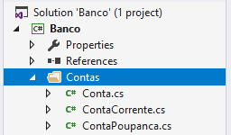

# Namespaces

Com o crescimento do sistema, passamos a ter diversas classes nele. Por exemplo, as que envolvem o modelo de nosso sistema como as classes ligadas a conta:

``` csharp
public abstract class Conta
{
    // Implementação da classe Conta
}
```

``` csharp
public class ContaCorrente : Conta
{
    // Implementação da classe ContaCorrente
}
```

``` csharp
public class ContaPoupanca : Conta
{
    // Implementação da classe ContaPoupanca
}
```

As classes voltadas ao relacionamento com o cliente:

``` csharp
public class Cliente
{
    // Implementação da classe Cliente
}
```

``` csharp
public class Gerente
{
    // Implementação da classe Gerente
}
```

As classes ligadas aos empréstimos feitos pelo cliente:

``` csharp
public class Credito
{
    // Implementação da classe Credito
}
```

``` csharp
public class CreditoImobiliario : Credito
{
    // Implementação da classe CreditoImobiliario
}
```

E as classes referentes aos investimentos:

``` csharp
public class Fundo
{
    // Implementação da classe Fundo
}
```

``` csharp
public class CDB
{
    // Implementação da classe CDB
}
```

O grande problema que surge com os sistemas grandes é a organização de todas as suas classes. Para evitar que o sistema fique caótico, podemos agrupar as classes por características comuns e dar um nome para cada um desses grupos. Isto é, agruparíamos um conjunto de classes em um espaço em comum e lhe daríamos um nome, como por exemplo `Caelum.Banco.Investimentos`. Esse espaço definido por um nome é chamado de **namespace**.

Segundo a convenção de nomes adotada pela Microsoft (http://msdn.microsoft.com/en-us/library/893ke618.aspx), os namespaces devem ter a forma: `NomeDaEmpresa.NomeDoProjeto.ModuloDoSistema`.

No nosso caso, os namespaces ficariam da seguinte forma:

``` csharp
namespace Caelum.Banco.Usuarios
{
  public class Cliente
  {
    // Implementação da classe Cliente
  }
}
```

``` csharp
namespace Caelum.Banco.Usuarios
{
  public class Gerente
  {
    // Implementação da classe Gerente
  }
}
```

``` csharp
namespace Caelum.Banco.Investimentos
{
  public class Fundo
  {
    // Implementação da classe Fundo
  }
}
```

``` csharp
namespace Caelum.Banco.Investimentos
{
  public class CDB
  {
    // Implementação da classe CDB
  }
}
```

Antes de realizar essa separação de nossas classes em namespaces, elas estavam no mesmo namespace: o namespace do nome do projeto. Assim, para definir o cliente referente a um investimento precisaríamos apenas criar um novo atributo na classe `Investimento`: `private Cliente cliente`.

Contudo, com o uso dos namespaces, a classe `Cliente` não está mais no mesmo namespace da classe `Investimento`. Para poder referenciar qualquer uma das quatro classes anteriores devemos indicar o seu namespace:

``` csharp
Caelum.Banco.Usuarios.Gerente guilherme = 
   new Caelum.Banco.Usuarios.Gerente();
Caelum.Banco.Usuarios.Cliente mauricio = 
   new Caelum.Banco.Usuarios.Cliente();
Caelum.Banco.Investimentos.Fundo acoes = 
   new Caelum.Banco.Investimentos.Fundo();
Caelum.Banco.Investimentos.CDB cdb = 
   new Caelum.Banco.Investimentos.CDB();
```

O nome completo de uma classe agora envolve adicionar uma referência ao namespace dela. Por isso, deixamos de acessar `Gerente` diretamente e passamos a acessar `Caelum.Banco.Usuarios.Gerente`.

Um exemplo de código já existente na plataforma C# que usa namespaces envolve imprimir uma única linha no console usando o método `WriteLine` de `System.Console`:

``` csharp
System.Console.WriteLine("Minha conta bancaria");
```

Note como o uso de namespaces para organizar suas classes acaba implicando em mais código na hora de utilizar as mesmas. Por isso, podemos criar atalhos ao dizer que usaremos as classes que pertencem a um namespace. Por exemplo, podemos citar que usaremos o namespace `System` e, a partir de então, podemos escrever nosso código como se tudo o que está dentro do namespace `System` estivesse no mesmo namespace em que estamos:

``` csharp
using System;

Console.WriteLine("Minha conta bancaria");
```

Podemos também usar vários namespaces dentro do mesmo arquivo:

``` csharp
using System;
using Caelum.Banco.Usuarios;

Console.WriteLine("Minha Conta Bancaria");
Cliente cliente = new Cliente();
```

A utilização da palavra chave `using` permite notificar ao compilador que usaremos classes daquele namespace. Com isso, obtemos a vantagem da organização do código através de namespace e continuamos com um código enxuto.

## Para saber mais - Declaração de namespace aninhados

No C#, podemos criar um namespace dentro de outro namespace já existente. Por exemplo:

``` csharp
namespace Caelum.Banco
{
    // dentro do namespace Caelum.Banco
    
    // agora podemos criar um namespace aninhado
    namespace Contas 
    {
        // o nome desse namespace é Caelum.Banco.Contas
    }
}
```

O namespace Contas do código acima também poderia ser declarado da seguinte forma:

``` csharp
namespace Caelum.Banco.Contas
{
    // também declara o namespace Caelum.Banco.Contas
}
```

Para a linguagem C#, as duas declarações são equivalentes.

## Para saber mais - Alias para namespaces

Em aplicações grandes, podemos ter namespaces com nomes muito grandes, por exemplo:

``` csharp
namespace Caelum.Banco.Produtos.Contas
{
    public abstract class Conta
    {
        // Implementação
    }
}
```

Vimos que, no código C#, podemos utilizar o `using` para não digitarmos o nome completo da classe toda vez que ela for utilizada, mas o que aconteceria se tivéssemos outra classe chamada `Conta`? Por exemplo, o banco tem um sistema de autenticação e a classe que guarda informações sobre o usuário é chamada `Conta`:

``` csharp
namespace Caelum.Banco.Seguranca
{
    public class Conta
    {
        // Implementação
    }
}
```

Claramente, as classes são diferentes pois possuem namespaces diferentes, mas no código que as utiliza, não podemos importar as duas classes pois o compilador do C# não saberá qual das duas estamos utilizando.

``` csharp
using Caelum.Banco.Produtos.Contas;
using Caelum.Banco.Seguranca;

namespace Banco.Sistema
{
    public class ControleAutenticacao
    {
        // Conta do usuário ou Conta do banco?
        public void Autentica(Conta conta)
        {
            // implementação
        }
    }
}
```

Nessa situação, precisamos escolher qual é o namespace que vamos importar. Se colocarmos um `using` para `Caelum.Banco.Produtos.Contas`, por exemplo, para utilizarmos a `Conta` do usuário precisamos do nome completo da classe, `Caelum.Banco.Seguranca.Conta`, um nome bem grande. Nessa situação, podemos dar um apelido (alias) menor para um namespace do C# com a palavra `using`:

``` csharp
using Caelum.Banco.Produtos.Contas;
using SegurancaDoBanco = Caelum.Banco.Seguranca;

namespace Banco.Sistema
{
    public class ControleAutenticacao
    {
        // Conta é a do namespace Caelum.Banco.Produtos.Conta
        // para usarmos a conta do usuário fazemos:
        // SegurancaDoBanco.Conta
        public void Autentica(SegurancaDoBanco.Conta contaUsuario)
        {
            // implementação
        }
    }
}
```

Podemos também definir um alias para uma classe do namespace:

``` csharp
using Caelum.Banco.Produtos.Contas;
using ContaDoUsuario = Caelum.Banco.Seguranca.Conta;

namespace Banco.Sistema
{
    public class ControleAutenticacao
    {
        // Conta é a do namespace Caelum.Banco.Produtos.Conta
        // para usarmos a conta do usuário, utilizamos ContaDoUsuario
        public void Autentica(ContaDoUsuario conta)
        {
            // implementação
        }
    }
}
```

## Exercícios
1. Como instanciar a classe Conta a seguir, que está dentro de um namespace?
	``` csharp
 namespace Caelum.Banco {
    public class Conta {
      // classe aqui
    }
 }
	```

	* new Conta();

	* new Conta.Caelum.Banco();

	* new Conta() in Caelum.Banco;

	* new Caelum.Banco.Conta();

	
1. Como importar a classe a seguir, usando `using`?

	``` csharp
 namespace Caelum.Banco
 {
  public abstract class Conta
  {
    // codigo aqui
  }
 }
	```

	* using Caelum;

	* using Caelum.Banco;

	* using Caelum.Banco.Conta;

	
1. Faça com que o namespace das contas da aplicação seja `Banco.Contas`, por exemplo, para a classe `Conta`, teríamos:

	``` csharp
 // arquivo Conta.cs
 namespace Banco.Contas
 {
    public class Conta
    {
        // implementação da classe Conta
    }
 }
	```

	Depois de fazermos essa modificação, as classes que utilizam a conta terão que importá-la com o `using` do C#. No formulário principal da aplicação, classe `Form1`, por exemplo, teríamos:

	``` csharp
 using Banco.Contas;

 namespace Banco
 {
    public class Form1 : Form
    {
        // implementação do formulário
    }
 }
	```

	Repare que o namespace é completamente separado da estrutura de pastas do projeto, ou seja, podemos organizar os arquivos do projeto da forma que desejarmos.
1. (Opcional) Mesmo que a estrutura de diretórios seja completamente separada do namespace, é sempre bom definirmos regras para a estrutura de pastas do projeto. Uma estrutura muito utilizada no .Net é colocar todas as classes de um determinado namespace dentro de um diretório com o mesmo nome do namespace. Para as contas da aplicação, por exemplo, teríamos a seguinte estrutura:

	

	Vamos mover os arquivos do projeto para seguirmos essa estrutura. Dentro do projeto `Banco`, crie uma nova pasta chamada `Contas` e dentro dessa pasta coloque todas as contas do sistema. Veja que podemos mover livremente os arquivos sem quebrar o código da aplicação.
