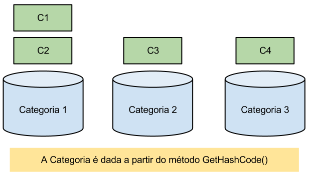
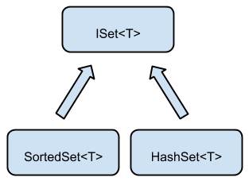
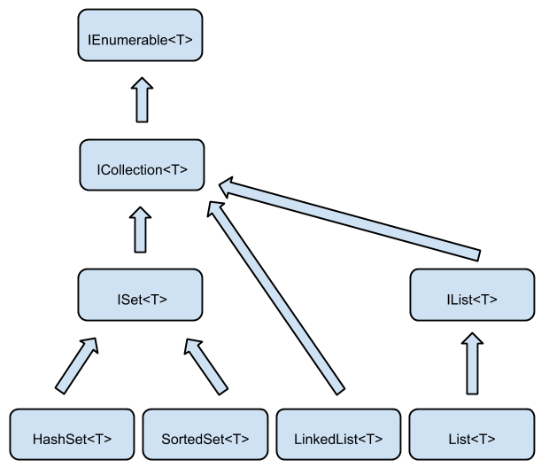
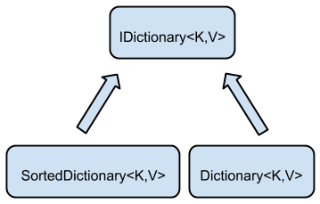
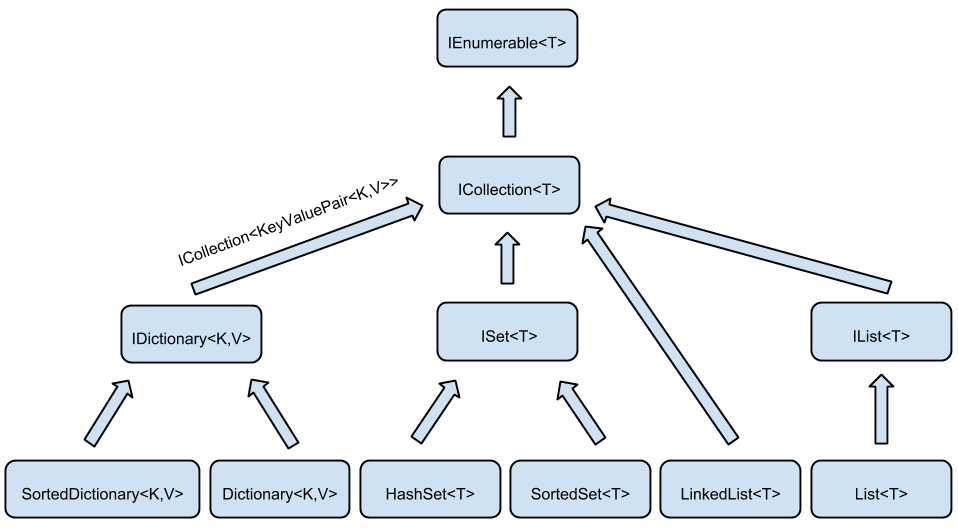

# Lidando com conjuntos

Agora estamos interessados em melhorar o cadastro de contas que implementamos nos
capítulos anteriores. O banco não quer aceitar o cadastro de contas cujo titular
seja devedor, então dentro do sistema precisamos guardar uma lista com nomes dos
devedores:

``` csharp
List<string> devedores = new List<string>();

devedores.Add("victor");
devedores.Add("osni");
```

Agora no cadastro precisamos verificar se o nome que foi digitado no formulário está
dentro dessa lista. Podemos fazer isso utilizando o método `Contains` da classe
`List`:

``` csharp
string titular = // lê o campo titular do cadastro
bool ehDevedor = devedores.Contains(titular);
```

Mas a implementação do `Contains` da lista precisa percorrer todos os nomes cadastrados
para só então devolver se o elemento está ou não dentro da lista. Dessa forma, dependendo do
tamanho da lista, essa busca pode ficar demorada.

## Otimizando a busca através de conjuntos

Como vimos, as listas não são muito otimizadas para as operações de buscas, pois além de
permitirem a repetição de elementos (que prejudica o desempenho da busca), precisam
percorrer todos os elementos para implementarem a operação `Contains`.

Quando precisamos que a operação de busca seja rápida, utilizamos os conjuntos do C# ao
invés das listas. Conjuntos são estruturas nas quais podemos fazer buscas rápidas e que não
permitem repetição de elementos.

Um dos tipos de conjuntos disponíveis no C# é a classe `HashSet`. Para buscar de maneira
rápida, o `HashSet` "categoriza" os seus elementos, de forma a encontrá-los rapidamente.
Por exemplo, imagine você em um supermercado. Se você quer comprar sorvete, você não olha
todos os itens do supermercado, mas sim vai direto para a seção de congelados. Lá, você
procura o seu sorvete favorito. Veja que você olhou muito menos elementos, pois foi direto
para a categoria dele. O `HashSet` faz a mesma coisa. Ele dá "categorias" para cada um
dos elementos, e quando busca por eles, vai direto para a categoria.



A categoria é dada a partir do método `GetHashCode()` que vem herdado da classe `Object`
do C#. Esse método devolve um número inteiro que representa qual é a categoria do objeto.

> **Cuidados ao sobrescrever o GetHashCode**
>
> Quando sobrescrevemos o método `Equals` de uma classe é uma boa prática também sobrescrevermos
> o método `GetHashCode`. Além disso, para que o `HashSet` funcione corretamente, a
> implementação do `GetHashCode` deve obedecer à seguinte regra:
>
> Se tivermos dois objetos, `objeto1` e `objeto2`, com `objeto1.Equals(objeto2)` devolvendo o valor
> `true`, então os métodos `GetHashCode` do `objeto1` e do `objeto2` devem devolver o mesmo valor.
> Ou seja, objetos iguais devem ser da mesma categoria.


Um detalhe interessante dos conjuntos é que você pode adicionar, remover e até mesmo verificar se um
elemento está lá. Mas diferentemente da lista, você não consegue pegar um elemento randômico nela.
Por exemplo, `conjunto[10]` não funciona! E isso faz sentido: não existe ordem em um conjunto.

``` csharp
HashSet<string> devedores = new HashSet<string>();
// Podemos adicionar elementos no conjunto utilizando o método Add
devedores.Add("victor");
devedores.Add("osni");

// Para sabermos o número de elementos adicionados, utilizamos a propriedade
// Count do conjunto. Nesse exemplo elementos guardará o valor 2
int elementos = devedores.Count;

// O conjunto não guarda elementos repetidos, então se tentarmos
// adicionar novamente a string "victor", o número de elementos
// continua sendo 2
devedores.Add("victor");

// Para perguntarmos se o conjunto possui um determinado elemento,
// utilizamos o método Contains
bool contem = devedores.Contains("osni");

// Não podemos pegar um elemento pela sua posição, pois os elementos do
// conjunto não possuem uma ordenação bem determinada. O código abaixo
// gera um erro de compilação:
devedores[0];
```

Para iterarmos nos elementos de um `HashSet`, podemos utilizar novamente o
comando `foreach`:

``` csharp
foreach(string devedor in devedores)
{
    MessageBox.Show(devedor);
}
```

Quando executamos o `foreach` em um `HashSet`, a ordem em que os elementos são
iterados é indefinida.

## Conjuntos Ordenados com o SortedSet

Em muitas aplicações além da busca rápida, também precisamos manter a ordenação
dos elementos de um conjunto. Nesse tipo de aplicação, podemos utilizar uma nova
classe do C# chamada `SortedSet`.

O `SortedSet` funciona de forma similar ao `HashSet`, utilizamos o `Add` para
adicionar um elemento, o `Remove` para remover itens, o `Count` para perguntar
quantos elementos estão armazenados e `Contains` para verificar se um determinado
elemento está no conjunto. A diferença é que no `HashSet` os elementos são espalhados
em categorias e por isso não sabemos qual é a ordem da iteração, já o `SortedSet`
guarda os elementos na ordem crescente. Então no exemplo do conjunto de devedores,
teríamos um conjunto em que os elementos estão em ordem alfabética:

``` csharp
SortedSet<string> devedores = new SortedSet<string>();

devedores.Add("Hugo");
devedores.Add("Ettore");
devedores.Add("Osni");
devedores.Add("Alberto");
devedores.Add("Victor");

// Esse foreach vai mostrar os nomes na seguinte ordem:
// Alberto, Ettore, Hugo, Osni e por fim Victor
foreach(string nome in devedores)
{
    MessageBox.Show(nome);
}
```

## A interface de todos os conjuntos

Vimos que temos duas classes que representam conjuntos no C#, o `HashSet` e o
`SortedSet`, em ambas as classes, quando queremos armazenar um elemento utilizamos
o método `Add`, para remover o `Remove`, para buscar o `Contains` e para saber
o número de elementos o `Count`, por esse motivo, existe uma interface que declara
todos os comportamentos comuns aos conjunto que é a interface `ISet`.



## Comparação entre listas e conjuntos

Vimos que as listas e os conjuntos são duas estruturas que expõem muitos métodos em comum,
mas que também possuem diversas diferenças:


* Nas listas os elementos são armazenados na ordem de inserção enquanto cada conjunto
armazena os elementos na ordem que desejar para otimizar o tempo de busca;
* Listas aceitam repetições enquanto os conjuntos não;
* Podemos acessar elementos de uma lista através de seu índice, uma operação que não faz
sentido no conjunto..


Como listas e conjuntos possuem muitas operações em comum, tanto as listas quanto os conjuntos
implementam uma outra interface do C# chamada `ICollection`:


Além disso, aprendemos que podemos utilizar o `foreach` com qualquer coleção do C#. Isso acontece porque o `foreach` aceita qualquer classe que implemente a interface
`IEnumerable`, que é uma super interface (interface pai) da `ICollection`:



## Exercícios
1. Qual a saída do programa a seguir?

	``` csharp
 var conjunto = new HashSet<Conta>();
 var c1 = new ContaCorrente();
 conjunto.Add(c1);
 conjunto.Add(c1);
 MessageBox.Show(conjunto.Count.ToString());
	```

	* 0

	* 1

	* Um Set não possui propriedade Count

	* 2

	
1. Como eliminar todos os elementos de um conjunto?

	``` csharp
 var conjunto = new HashSet<Conta>();
 conjunto.????();
	```

	* `.Clear()`

	* `.DeleteAll()`

	* `.Reset()`

	* `.Empty()`

	
1. No Banco, não podemos criar novas contas para clientes que são devedores, então na
	tela de cadastro de nova conta, antes de criarmos a nova conta que será adicionada
	na aplicação precisamos verificar se ela está em uma lista de devedores que contém
	`30000` nomes.

	Adicione no projeto uma nova pasta chamada `Busca` e dentro dessa pasta crie uma
	nova classe chamada `GeradorDeDevedores` com o seguinte código:

	``` csharp
 namespace Banco.Busca
 {
    public class GeradorDeDevedores
    {
        public List<string> GeraList()
        {
            List<string> nomes = new List<string>();
            for(int i = 0; i < 30000; i++)
            {
                nomes.Add("devedor " + i);
            }
            return nomes;
        }
    }
 }
	```

	Essa é a classe que será responsável por gerar a lista de devedores que utilizaremos
	na aplicação.

	No construtor do formulário de cadastro, classe `FormCadastroConta`, vamos utilizar
	o `GeradorDeDevedores` para inicializar a lista de devedores:

	``` csharp
 public partial class FormCadastroConta : Form
 {
    private ICollection<string> devedores;

    private Form1 formPrincipal;

    public FormCadastroConta(Form1 formPrincipal)
    {
        this.formPrincipal = formPrincipal;
        InitializeComponent();

        GeradorDeDevedores gerador = new GeradorDeDevedores();
        this.devedores = gerador.GeraList();
    }

    // Resto da classe continua igual
 }
	```

	Agora na ação do botão de cadastro, antes de criarmos a conta, precisamos verificar se
	o titular dessa nova conta é devedor:

	``` csharp
 private void botaoCadastro_Click(object sender, EventArgs e)
 {
    string titular = textoTitular.Text;
    bool ehDevedor = this.devedores.Contains(titular);
    if(!ehDevedor)
    {
        // faz a lógica para criar a conta
    }
    else
    {
        MessageBox.Show("devedor");
    }
 }
	```
1. Para verificarmos a diferença entre o tempo de busca de listas e conjuntos, vamos repetir a
	busca `30000` vezes dentro de um loop:

	``` csharp
 private void botaoCadastro_Click(object sender, EventArgs e)
 {
    string titular = this.textoTitular.Text;
    bool ehDevedor = false;
    for(int i = 0; i < 30000; i++)
    {
        ehDevedor = this.devedores.Contains(titular);
    }
    if(!ehDevedor)
    {
        // faz a lógica para criar a conta
    }
    else
    {
        MessageBox.Show("devedor");
    }
 }
	```
	Enquanto o código está executando, tente mover a janela. O que aconteceu?
1. Agora modifique o `GeradorDeDevedores` para que ele utilize um `HashSet`
	ao invés de um `List`:

	``` csharp
    public HashSet<string> GeraList()
    {
        HashSet<string> nomes = new HashSet<string>();
        for(int i = 0; i < 30000; i++)
        {
            nomes.Add("devedor " + i);
        }
        return nomes;
    }
	```

	Repare que, para utilizarmos o `HashSet`, precisamos mudar os tipos do objeto
	instanciado, da variável e do retorno no método. O que podemos fazer para evitar
	tantas mudanças quando queremos trocar a implementação de coleção que usamos?
1. Teste novamente o cadastro da conta e veja que dessa vez a busca é mais rápida.
1. Experimente também outras coleções no método `GeraList`.


## Buscas rápidas utilizando Dicionários

No projeto do banco, temos diversas contas cadastradas e agora queremos criar uma
nova busca de conta por nome do titular. Para implementar essa busca, podemos iterar
na lista de contas e comparar o nome do titular de cada uma dessas contas:

``` csharp
IList<Conta> contas = // pega as contas cadastradas
string titularDaBusca = "victor";
Conta resultado = null;
foreach(Conta conta in contas)
{
    if(conta.Titular.Nome.Equals(titularDaBusca))
    {
        resultado = conta;
        break;
    }
}
```

Agora repare que em todo ponto do código em que precisamos buscar uma conta pelo nome do
titular, precisamos repetir esse bloco de código, além disso, essa busca passa por todas
as contas cadastradas no sistema, o que pode demorar bastante. Para resolver esse problema
de forma eficiente, o C# nos oferece os Dicionários (`Dictionary`).

O `Dictionary` é uma classe que consegue associar uma chave a um valor. Utilizando o
dicionário, podemos, por exemplo, associar o nome do titular com uma conta do sistema.
Quando vamos construir um dicionário dentro do código, precisamos informar qual é o tipo
da chave e qual será o tipo do valor associado a essa chave, para implementarmos a busca
de contas, precisaríamos de um dicionário que associa uma chave do tipo `string` com uma
`Conta`.

``` csharp
Dictionary<String, Conta> dicionario = new Dictionary<String, Conta>();
```

Agora para colocarmos um valor no dicionário, utilizamos o método `Add`:

``` csharp
Dictionary<String, Conta> dicionario = new Dictionary<String, Conta>();
Conta conta = // inicializa a conta

// vamos adicionar a conta no dicionário
// associa o nome do titular com a conta.
dicionario.Add(conta.Titular.Nome, conta);
```

Depois que inicializamos o dicionário, podemos realizar buscas de valores utilizando as
chaves que foram cadastradas. Vamos, por exemplo, buscar a conta de um titular chamado
`"Victor"`:

``` csharp
Conta busca = dicionario["Victor"];
```

Veja que utilizando dicionários a busca por nomes ficou muito mais simples do que a busca
utilizando o `foreach`, além disso, as buscas com dicionários são tão rápidas quanto
buscas utilizando conjuntos, ou seja, muito mais eficientes do que o nosso `foreach` inicial.

## Iterando no dicionário

Além de fazermos buscas rápidas, podemos também iterar nos elementos que estão armazenados,
para isso também utilizamos o `foreach` do C#. Porém qual será o tipo que utilizaremos
dentro do `foreach`?

Ao iterarmos em um dicionário, o tipo utilizado dentro do `foreach` é um tipo que consegue
guardar um par de chave associado a um valor do dicionário (`KeyValuePair`). Logo, no código
do `foreach` o tipo seria `KeyValuePair<tipo da chave, tipo do valor>`:

``` csharp
Dictionary<string, Conta> dicionario = new Dictionary<string, Conta>();
// preenche o dicionário

foreach(KeyValuePair<string, Conta> par in dicionario)
{
    // podemos acessar a chave atual do dicionário
    string chave = par.Key;
    
    // e podemos pegar o valor associado à chave
    Conta valor = par.Value;
}
```

Assim como no `HashSet`, quando iteramos em um dicionário, seus elementos não estão em nenhuma
ordem em particular, logo não podemos depender da ordem dos elementos do dicionário. Quando estamos
trabalhando com um algoritmo que depende da ordem dos elementos, precisamos utilizar um outro tipo
de dicionário chamado `SortedDictionary`. O uso do `SortedDictionary` é igual ao do `Dictionary`,
porém seus elementos estão sempre na ordem crescente das chaves do dicionário.

No C#, temos uma interface implementada por todos os tipos os tipos de dicionários, a `IDictionary`,
além disso, os dicionários também implementam a interface `ICollection` do C#, porém eles
são coleções de `KeyValuePair`. Podemos ver sua hierarquia na imagem a seguir:



A hierarquia das coleções do C# fica da seguinte forma:



## Exercícios
1. Em nosso banco, precisamos implementar uma nova busca de contas por nome do titular. Para implementarmos
	essa busca, utilizaremos os dicionários do C#.

	No formulário principal da aplicação, coloque um novo campo de texto que receberá qual é o nome do titular
	da busca. Chame esse campo de `textoBuscaTitular`. Além desse novo campo de texto, coloque também
	um novo botão que quando clicado executará a busca por nome, chame esse botão de `botaoBusca`. O
	seu formulário deve ficar parecido com o que segue:

	

	Para implementarmos essa busca por nome de titular, o formulário precisa de um novo atributo do
	tipo `Dictionary`. Quais devem ser os tipos da chave e do valor do dicionário? Agora que temos
	o dicionário, toda vez que criamos uma nova conta, precisamos adicioná-la à lista de contas, no
	combo box e no dicionário de contas, mas como o formulário possui um método especializado em
	adicionar novas contas, o `AdicionaConta`, só precisamos modificar a implementação desse método.
	Repare que como o código está encapsulado, precisamos apenas modificar esse método que tudo
	funcionará automaticamente.

	``` csharp
 public partial class Form1 : Form 
 {
    private Dictionary<string, Conta> dicionario;

	private void Form1_Load(object sender, EventArgs e)
	{
		this.dicionario = new Dictionary<string, Conta>();

		// resto do método
	}

	public void AdicionaConta(Conta conta)
	{
		contas.Add(conta);
		comboContas.Items.Add(conta);

		// agora só precisamos atualizar o dicionário
		this.dicionario.Add(conta.Titular.Nome, conta);
	}

	// Resto do código da classe
 }
	```

	Agora que já preparamos o dicionário, precisamos apenas utilizá-lo para implementar a ação do
	botão de busca por titular.

	``` csharp
 private void botaoBusca_Click(object sender, EventArgs e)
 {
    // Precisamos primeiro buscar qual é o nome do titular que foi digitado
	// no campo de texto
	string nomeTitular = textoBuscaTitular.Text;

	// Agora vamos usar o dicionário para fazer a busca.
	// Repare como o código de busca fica simples
	Conta conta = dicionario[nomeTitular];

	// E agora só precisamos mostrar a conta que foi encontrada na busca
	textoTitular.Text = conta.Titular.Nome;
	textoNumero.Text = Convert.ToString(conta.Numero);
	textoSaldo.Text = Convert.ToString(conta.Saldo);
 }
	```
1. (Opcional) No código do exercício passado, quando encontramos uma conta dentro do dicionário,
	estamos apenas atualizando as informações que são mostradas nos campos `textoNumero`,
	`textoSaldo` e `textoTitular`, porém quando tentamos fazer uma operação, sempre utilizamos
	o item que está selecionado atualmente no `comboContas`. Precisamos utilizar a conta devolvida
	pelo dicionário para atualizar o valor selecionado do `comboContas`, para fazer isso, precisamos
	apenas atribuir a conta que queremos selecionar na propriedade `SelectedIndex` do `comboContas`:

	``` csharp
 private void botaoBusca_Click(object sender, EventArgs e)
 {
    string nomeTitular = textoBuscaTitular.Text;
	Conta conta = dicionario[nomeTitular];

	// Agora vamos atualizar o item selecionado do comboContas:
	comboContas.SelectedItem = conta;
 }
	```

	Quando escrevemos na propriedade `SelectedItem`, o Windows Forms automaticamente chama a ação
	de mudança de item selecionado do combo box (o `comboContas_SelectedIndexChanged`), logo não
	precisamos nos preocupar em atualizar os campos de texto no código da busca por nome do titular.
1. 
	O que acontece quando tentamos buscar um nome de titular que não existe? Tente modificar o código do
	formulário para corrigir o problema.
