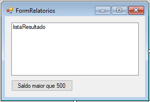
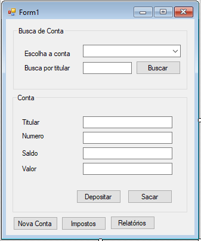
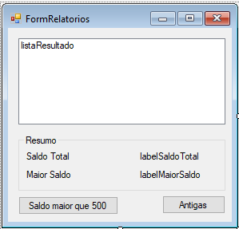

# LINQ e Lambda


Nosso banco armazena uma lista de contas. Essas contas possuem os mais variados correntistas,
saldos e tipos. Muitas vezes, precisamos filtrá-las de alguma forma. Por exemplo, se
quisermos pegar todas as contas com saldo maior que 2000 reais, fazemos:

``` csharp
var lista = new List<Conta>();

// inserimos algumas contas
lista.Add(...); 

// cria lista que usaremos para guardar os elementos filtrados
var filtrados = new List<Conta>();
foreach(var c : lista)
{
  if(c.Saldo > 2000)
  {
     filtrados.Add(c);
  }
}

// agora a variavel "filtrados" tem as contas que queremos!
```

Se complicarmos ainda mais o filtro (por exemplo, contas com saldo maior que 2000 e menor que
5000, com data de abertura entre os anos 2010 e 2012, ...), nosso código ficará também mais
complexo, além disso, se quiséssemos aplicar um filtro em uma lista com outro tipo de objeto,
teríamos que repetir novamente o código do `foreach` em diversos pontos da aplicação.

## Filtros utilizando o LINQ

Para filtrar uma lista, seria muito mais interessante que a própria coleção tivesse algum método
que recebesse a condição que queremos aplicar nesse filtro e já implementasse a lógica do `foreach`,
algo como:

``` csharp
List<Conta> contas = // inicializa a lista

var filtradas = contas.Filtra(condição);
```

Mas como passar a condição para esse filtro? Teríamos que enviar um bloco de código que aceita
ou rejeita os valores da coleção. Para passar um bloco de código que pode ser utilizado por um
método, o C# introduziu as **funções anônimas** ou **lambdas**. As funções anônimas funcionam
como métodos estáticos da linguagem com uma declaração simplificada. Para declarar uma função
anônima que recebe um argumento do tipo `Conta` utilizamos o seguinte código:

``` csharp
(Conta c) => { // implementação da função anônima }
```

Dentro do bloco de implementação da função anônima, colocaremos a implementação da condição:

``` csharp
(Conta c) => { return c.Saldo > 2000; }
```

E agora essa função pode ser passada para dentro do método `Filtra`:

``` csharp
contas.Filtra((Conta c) => { return c.Saldo > 2000; });
```

No C# temos exatamente a implementação dessa ideia, mas o método se chama `Where` ao invés de
`Filtra`. Então, para buscarmos todas as contas que têm um saldo maior do que 2000, utilizaríamos
o seguinte código:

``` csharp
List<Conta> contas = // inicializa a lista
var filtradas = contas.Where((Conta c) => { return c.Saldo > 2000; });
```

Agora que temos a lista de contas filtradas, podemos, por exemplo, iterar nessa lista:

``` csharp
foreach(Conta conta in filtradas)
{
    MessageBox.Show(conta.Titular.Nome);
}
```

A biblioteca do C# que define o método `Where` é chamada **LINQ**, a **Language Integrated Query**.

## Simplificando a declaração do lambda

Veja que, no código do lambda que passamos como argumento para o `Where`, definimos que o argumento
da função anônima é do tipo `Conta` porque a lista da variável `contas` é do tipo `Conta`.
Repare que o tipo do argumento do lambda na verdade é redundante e por isso, desnecessário:

``` csharp
var filtradas = contas.Where(c => { return c.Saldo > 2000; });
```

Além disso, quando declaramos uma função anônima que tem apenas uma linha que devolve um valor,
podemos remover inclusive as chaves e o `return` da declaração do lambda:

``` csharp
var filtradas = contas.Where(c => c.Saldo > 2000 );
```

Veja que esse código final é muito mais simples do que a declaração inicial que utilizamos para a
função anônima.

## Outros métodos do LINQ

Agora imagine que queremos saber qual é a soma do saldo de todas as contas que estão cadastradas
dentro da aplicação. Para resolver esse problema, teríamos que fazer um código parecido com o seguinte:

``` csharp
List<Conta> contas = // inicializa a lista de contas
double total = 0.0;

foreach(Conta c in contas)
{
    total += c.Saldo;
}
```

Porém esse tipo de código também acaba ficando repetitivo. Quando queremos fazer a soma dos
elementos de uma lista, podemos utilizar o método **Sum** do LINQ, passando um lambda que fala
qual é a propriedade da conta que queremos somar:

``` csharp
double total = contas.Sum(c => c.Saldo);
```

Com essa linha de código conseguimos o mesmo efeito do `foreach` anterior. Além do `Sum`,
também podemos utilizar o método **Average** para calcular a média dos valores, **Count**
para contar o número de valores que obedecem algum critério, **Min** para calcular o menor
valor e **Max** para calcular o maior valor:

``` csharp
List<Conta> contas = // inicializa a lista

// soma dos saldos de todas as contas
double saldoTotal = contas.Sum(c => c.Saldo);

// media do saldo das contas
double mediaDosSaldos = contas.Average(c => c.Saldo);

// número de contas que possuem Numero menor do que 1000
int numero = contas.Count(c => c.Numero < 1000);

int menorNumero = contas.Min(c => c.Numero);

double maiorSaldo = contas.Max(c => c.Saldo);
```

Quando utilizamos esses métodos de agregação em uma lista com tipos primitivos, o lambda é
um argumento opcional. Por exemplo, se tivéssemos uma lista de `double`, poderíamos utilizar
o seguinte código para calcular a média dos números:

``` csharp
List<double> saldos = // inicializa a lista

double media = saldos.Average();
```

## Utilizando o LINQ com outros tipos

O LINQ, além de trabalhar com listas, também pode ser utilizados com outros tipos de coleções,
podemos utilizar o LINQ com qualquer objeto que implemente a interface `IEnumerable`, ou seja,
ele pode ser utilizado com qualquer objeto que possa ser passado para a instrução `foreach`.
Isso inclui todos os tipos de coleções (Listas, conjuntos e dicionários) e arrays.

## Melhorando as buscas utilizando a sintaxe de queries

Vimos que utilizando o LINQ podemos fazer filtros e agregações de uma forma fácil em qualquer
coleção do C#, porém quando precisamos fazer um filtro complexo, o lambda pode ficar com um
código complexo. E por isso, a Microsoft decidiu facilitar ainda mais o uso do LINQ.

Para implementarmos um filtro, em vez de utilizarmos o método `Where`, podemos utilizar
uma sintaxe que foi baseada na linguagem de busca em banco de dados, a SQL. Para começarmos um
filtro utilizando essa nova sintaxe, precisamos começar o filtro com a palavra **from** criando
uma variável que será utilizada para navegar na lista:

``` csharp
var filtradas = from c in contas
```

Agora para colocarmos uma condição nesse filtro, utilizamos a palavra **where** passando qual é
a condição a que a conta deve obedecer para aparecer como resultado desse filtro:

``` csharp
var filtradas = from c in contas
                where c.Numero < 2000
```

E por fim, precisamos apenas informar o que será selecionado utilizando o **select**:

``` csharp
var filtradas = from c in contas
                where c.Numero < 2000
                select c;
```

Com esse código, estamos definindo um filtro que devolverá apenas as contas que têm número
menor do que 2000.

Quando o compilador da linguagem C# encontra o filtro que definimos, esse código é convertido
para uma chamada para o método `Where` que vimos anteriormente. Essa nova sintaxe é apenas um
jeito de esconder a complexidade do lambda.

## Para saber mais — projeções e objetos anônimos

Muitas vezes, quando estamos usando o LINQ, o filtro não precisa retornar todas as informações dos
objetos da lista que está sendo processada. Podemos estar interessados em buscar apenas o número
das contas que obedecem os critérios da busca, para isso precisamos apenas mudar o `select` do LINQ.

``` csharp
List<Conta> contas = // inicializa a lista

var resultado = from c in contas where <condição da busca> select c.Numero;
```

O resultado dessa busca será uma coleção de números inteiros.

Mas e quando queremos devolver mais atributos da conta? Como no LINQ podemos apenas devolver um
objeto como resultado da query, teríamos que criar uma classe que contém os atributos que serão
devolvidos pela query, mas muitas vezes nós fazemos a busca e utilizamos o resultado dentro de um
único ponto da aplicação (dentro de um método, por exemplo). Nesses casos, podemos deixar o compilador
do C# cuidar da criação desse objeto anônimo:

``` csharp
var resultado = from c in contas 
                where <condição da busca> 
                select new { c.Numero, c.Titular };
```

Nesse código, o compilador do C# cria um novo tipo que será utilizado para guardar o resultado
da busca. Esse tipo não possui um nome dentro do código e por isso o objeto devolvido é chamado
de **Objeto Anônimo**. Quando utilizamos o objeto anônimo no LINQ, somos forçados a utilizar a
inferência de tipos (palavra `var`).

No exemplo, o objeto anônimo devolvido pelo compilador possui as propriedades `Titular` e
`Numero`, portanto podemos utilizá-las dentro de um `foreach`:

``` csharp
foreach (var c in filtradas)
{
    // aqui dentro podemos apenas usar o Titular e o Numero, 
    // se tentarmos acessar o Saldo teremos um erro de compilação
    MessageBox.Show(c.Titular.Nome + " " + c.Numero);
}
```

## Exercícios
1. Crie um novo formulário chamado `FormRelatorios`. Utilizá-lo-emos para mostrar o resultado
	de queries feitas utilizando o LINQ.

	No editor gráfico desse novo formulário, abra a janela `Toolbox` e adicione o componente `ListBox`,
	chame-o de `listaResultado`. Utilizaremos esse `ListBox` para mostrar os resultados
	devolvidos pelo LINQ.

	Agora vamos criar nosso primeiro relatório, o de busca de contas com saldo maior do que 5000,
	através de um novo botão dentro da janela. Utilize o nome `botaoFiltroSaldo`:

	

	Quando esse botão for clicado, queremos executar um filtro com o LINQ:

	``` csharp
 private void botaoFiltroSaldo_Click(object sender, EventArgs e)
 {
    // Aqui implementaremos o filtro
 }
	```

	Como os relatórios precisarão da lista de contas, pediremos essa lista no construtor da janela:

	``` csharp
 public partial class FormRelatorios : Form 
 {
	private List<Conta> contas;
	public FormRelatorios(List<Conta> contas) 
	{
		InitializeComponent();
		this.contas = contas;
	}
	// outros métodos da janela.
 }
	```

	Dentro da ação do botão, implemente a busca por todas as contas que possuem saldo maior do que 5000.
	Agora utilizaremos o `ListBox` para mostrar as contas devolvidas pelo LINQ.

	O `ListBox` funciona como o `ComboBox`. Quando queremos adicionar uma nova linha, precisamos adicionar o
	objeto que queremos mostrar dentro da propriedade `Items` do `ListBox`. Ele mostrará o `ToString()` do
	objeto adicionado. Como utilizaremos esse `ListBox` para mostrarmos o resultado de diversas buscas,
	precisamos limpar o resultado anterior antes de mostrar o próximo, e fazemos isso através do método
	`Clear()` da propriedade `Items`:

	``` csharp
 private void botaoFiltroSaldo_Click(object sender, EventArgs e)
 {
	listaResultado.Items.Clear();
    var resultado = // query do LINQ
    foreach (var c in resultado)
    {
        listaResultado.Items.Add(c);
    }
 }
	```

	Agora para testarmos essa busca, vamos adicionar um novo botão dentro do formulário principal, classe `Form1`,
	chamado `botaoRelatorio` que instanciará o formulário `FormRelatorios` passando a lista de contas como
	argumento e depois chamará o `ShowDialog` para mostrar essa nova janela:

	
	``` csharp
 private void botaoRelatorio_Click(object sender, EventArgs e)
 {
    FormRelatorios form = new FormRelatorios(this.contas);
    form.ShowDialog();
 }
	```
1. Agora vamos implementar um novo relatório com o LINQ. Dessa vez, queremos listar todas as contas
	antigas (numero menor do que 10) com saldo maior do que 1000. Para isso crie um novo botão na janela
	de relatórios que quando clicado executará a query do LINQ na lista de contas e mostra o resultado
	dentro do `ListBox` que criamos no exercício anterior.
1. Agora vamos colocar resumos das informações contidas no relatório. Para isso, colocar dentro do
	relatório um novo `GroupBox` que terá o título `Resumo`. Dentro desse `GroupBox`, mostraremos, por exemplo,
	qual é o saldo da conta de maior `Saldo` e qual é o `Saldo` total de todas as contas.

	Além desse `GroupBox`, coloque algumas 4 labels para mostrar os resumos desse relatório. O primeiro deve mostrar
	o texto `Saldo Total`, o segundo, o texto `Maior Saldo`. Os dois labels restantes serão utilizados para mostrar
	os resumos — chame o terceiro label de `labelSaldoTotal` e o último de `labelMaiorSaldo`.
	Seu formulário deve ficar parecido com a figura a seguir:

	

	Depois de modificarmos o formulário, vamos modificar as ações do botão para que elas, além de fazerem
	a busca, também atualizem o resumo com as informações da busca. Podemos extrair os resumos da seguinte
	forma:

	``` csharp
 private void botaoFiltroSaldo_Click(object sender, EventArgs e)
 {
	listaResultado.Items.Clear();
    var resultado = // query do LINQ
    foreach (var c in resultado)
    {
        listaResultado.Items.Add(c);
    }
    double saldoTotal = resultado.Sum(conta => conta.Saldo);
    double maiorSaldo = resultado.Max(conta => conta.Saldo);

    labelSaldoTotal.Text = Convert.ToString(saldoTotal);
    labelMaiorSaldo.Text = Convert.ToString(maiorSaldo);
 }
	```

	Experimente a API do LINQ, tentando criar novas queries e extrair outras informações para o resumo do
	relatório.


## Ordenando coleções com LINQ

Além de fazermos buscas e projeções, podemos também utilizar o LINQ para ordenar coleções
de elementos. Para isso precisamos apenas colocar um **orderby** dentro da query. Por exemplo,
para buscarmos todas as contas com saldo maior do que 10000 ordenadas pelo nome do titular,
utilizamos o seguinte código:

``` csharp
List<Conta> contas = // inicializa a lista de contas
var resultado = from c in contas
                where c.Saldo > 10000
                orderby c.Titular.Nome
                select c;
```

Com isso temos uma lista de contas ordenadas pelo nome do titular de forma ascendente (alfabética).
Assim como podemos fazer a ordenação ascendente, também podemos fazer a ordenação descendente
utilizando a palavra **descending**:

``` csharp
List<Conta> contas = // inicializa a lista de contas
var resultado = from c in contas
                where c.Saldo > 10000
                orderby c.Titular.Nome descending
                select c;
```

Mas e se tivermos dois titulares com exatamente o mesmo nome? Nesse caso, podemos definir um
segundo critério para desempatar a ordenação. Cada um dos critérios da ordenação fica separado
por vírgula no `orderby`. No exemplo, para desempatarmos a ordenação utilizando o número da conta,
utilizamos o seguinte código:

``` csharp
List<Conta> contas = // inicializa a lista de contas
var resultado = from c in contas
                where c.Saldo > 10000
                orderby c.Titular.Nome descending, c.Numero
                select c;
```

O segundo critério de ordenação também pode ter opcionalmente a palavra `descending`:

``` csharp
List<Conta> contas = // inicializa a lista de contas
var resultado = from c in contas
                where c.Saldo > 10000
                orderby c.Titular.Nome descending, c.Numero descending
                select c;
```

Assim como no caso do filtro, as ordenações do LINQ também são traduzidas para chamadas de
método pelo compilador do C#. Quando colocamos um `orderby` na busca, o compilador chama o método
`OrderBy` (ou `OrderByDescending` no caso de uma ordenação descendente). A query com o filtro
e a ordenação pelo titular fica da seguinte forma:

``` csharp
var resultado = contas
                    .Where(c => c.Saldo > 10000)
                    .OrderBy(c => c.Titular.Nome);
```

Quando colocamos uma ordenação secundária, o compilador do C# chama o método `ThenBy`
(ou `ThenByDescending` no caso de uma ordenação secundária descendente):

``` csharp
var resultado = contas
                    .Where(c => c.Saldo > 10000)
                    .OrderBy(c => c.Titular.Nome)
                    .ThenBy(c => c.Numero);
```


## Exercícios - Ordenação
1. Vamos adicionar uma ordenação na tela de relatórios. Faça com que os botões que geram os
	relatórios mostrem as contas ordenadas pela ordem alfabética do nome do titular.
1. (Opcional) Agora tente fazer a mesma ordenação do exercício passado utilizando o método `OrderBy` do LINQ.
1. (Opcional) Tente utilizar também uma ordenação secundária pelo número da conta em seus relatórios.
