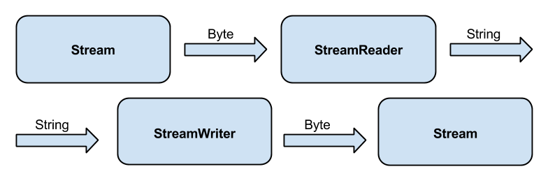
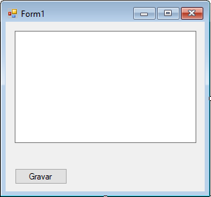

# System.IO

Agora que já vimos que podemos utilizar o C# para desenvolver um sistema orientado a objetos,
vamos aprender como utilizar as bibliotecas do `System.IO` para ler e escrever dados em arquivos.

## Leitura de arquivos

A entrada de dados no C# funciona em duas etapas. Na primeira etapa, temos uma classe abstrata
que representa uma sequência de bytes na qual podemos realizar operações de leitura e escrita. Essa classe abstrata é chamada de `Stream`.

Como o `Stream` é uma classe abstrata, não podemos usá-la diretamente, precisamos de uma
implementação para essa classe. No caso de leitura ou escrita em arquivos, utilizamos um tipo de
`Stream` chamado `FileStream`, que pode ser obtido através do método estático `Open` da classe
`File`. Quando utilizamos o `Open`, devemos passar o nome do arquivo que será aberto e devemos
informá-lo o que queremos fazer com o arquivo (ler ou escrever).

Para abrirmos o arquivo `entrada.txt` para leitura, utilizamos o código a seguir:

``` csharp
Stream entrada = File.Open("entrada.txt", FileMode.Open);
```

Agora que temos o `Stream`, podemos ler seu próximo `byte` utilizando o método `ReadByte`.

``` csharp
byte b = entrada.ReadByte();
```

Porém, trabalhar com bytes não é fácil, queremos trabalhar com textos! Portanto vamos utilizar a
segunda parte da leitura.

Para facilitar a leitura de Streams, o C# nos oferece uma classe chamada `StreamReader`,
responsável por ler caracteres ou strings de um `Stream`. O `StreamReader` precisa saber qual
é a `Stream` que será lida, portanto passaremos essa informação através de seu construtor:

``` csharp
StreamReader leitor = new StreamReader(entrada);
```

Para ler uma linha do arquivo, utilizamos o método `ReadLine` do `StreamReader`:

``` csharp
string linha = leitor.ReadLine();
```

Enquanto o arquivo não terminar, o método `ReadLine()` devolve um valor diferente de nulo, portanto,
podemos ler todas as linhas de um arquivo com o seguinte código:

``` csharp
string linha = leitor.ReadLine();
while(linha != null) 
{
    MessageBox.Show(linha);
    linha = leitor.ReadLine();
}
```

Assim que terminamos de trabalhar com o arquivo, devemos sempre lembrar de fechar o `Stream` e o
`StreamReader`:

``` csharp
leitor.Close();
entrada.Close();
```

O código completo para ler de um arquivo fica da seguinte forma:

``` csharp
Stream entrada = File.Open("entrada.txt", FileMode.Open);
StreamReader leitor = new StreamReader(entrada);
string linha = leitor.ReadLine();
while(linha != null)
{
    MessageBox.Show(linha);
    linha = leitor.ReadLine();
}
leitor.Close();
entrada.Close();
```

Porém, o arquivo pode não existir e, nesse caso, o C# lança a `FileNotFoundException`.
Devemos, portanto, verificar se o arquivo existe antes de abri-lo para leitura. Podemos
verificar se um arquivo existe utilizando o método `Exists` da classe `File`:

``` csharp
if(File.Exists("entrada.txt")) 
{
    // Aqui temos certeza que o arquivo existe
}
```

O código da leitura com a verificação fica assim:

``` csharp
if(File.Exists("entrada.txt"))
{
    Stream entrada = File.Open("entrada.txt", FileMode.Open);
    StreamReader leitor = new StreamReader(entrada);
    string linha = leitor.ReadLine();
    while(linha != null)
    {
        MessageBox.Show(linha);
        linha = leitor.ReadLine();
    }
    leitor.Close();
    entrada.Close();
}
```

> **Lendo todo o conteúdo de um arquivo**
>
> Vimos que para ler todas as linhas de um arquivo, precisamos utilizar o método
> `ReadLine` até que o retorno seja o valor `null`, mas isso é trabalhoso.
>
> Ao invés de chamar o método `ReadLine` para cada linha, podemos utilizar o método
> `ReadToEnd` da classe `StreamReader`. Esse método devolve uma `string` com
> todo o conteúdo do arquivo.


## Escrevendo em arquivos

Assim como a leitura, a escrita também acontece em duas etapas. Na primeira etapa,
trabalhamos novamente escrevendo bytes para a saída. Para isso utilizaremos novamente a classe
abstrata `Stream`.

Para escrevermos em um arquivo, precisamos primeiro abri-lo em modo de escrita utilizando o método
`Open` do `File` passando o modo `FileMode.Create`:

``` csharp
Stream saida = File.Open("saida.txt", FileMode.Create);
```

Porém, não queremos trabalhar com Bytes, então utilizaremos uma classe especializada em escrever
em um `Stream` chamada `StreamWriter`.

``` csharp
StreamWriter escritor = new StreamWriter(saida);
```

Podemos escrever uma linha com o `StreamWriter` utilizando o método `WriteLine`:

``` csharp
escritor.WriteLine("minha mensagem");
```

Depois que terminamos de utilizar o arquivo, precisamos fechar todos os recursos:

``` csharp
escritor.Close();
saida.Close();
```

O código completo para escrever no arquivo fica da seguinte forma:

``` csharp
Stream saida = File.Open("saida.txt", FileMode.Create);
StreamWriter escritor = new StreamWriter(saida);
escritor.WriteLine("minha mensagem");
escritor.Close();
saida.Close();
```

Repare que, por usarmos uma classe abstrata, podemos então trocar facilmente a classe
concreta por outra. Por exemplo, poderíamos ler de um Socket, ou de uma porta serial,
e o código seria o mesmo: basta a classe ser filha de `Stream`. Repare que o uso de
classes abstratas e polimorfismo nos possibilita ler/escrever em diferentes lugares com
o mesmo código. Veja que a própria Microsoft fez bom uso de orientação a objetos para
facilitar a vida dos desenvolvedores.

O IO do C# pode ser esquematizado pela seguinte figura:



> **Onde os arquivos são gravados**
>
> Quando passamos apenas o nome do arquivo no código do `File.Open`, o C# procura esse
> arquivo dentro da pasta em que a aplicação é executada. No caso de executarmos a aplicação
> pelo Visual Studio, a pasta utilizada pela aplicação será a pasta em que o projeto foi criado.


## Gerenciando os arquivos com o using

Toda vez que abrimos um arquivo dentro de um programa C#, precisamos fechá-lo utilizando
o método `Close`. Devemos garantir que o `Close` será executado mesmo quando o código
lança uma exceção durante sua execução, para isso podemos utilizar o bloco `finally`:

``` csharp
Stream arquivo = null;
StreamReader leitor = null;
try
{
    arquivo = File.Open("arquivo.txt", FileMode.Open);
    leitor = new StreamReader(arquivo);
    // utiliza o arquivo
}
catch (Exception ex)
{
    // Executa o tratamento do erro que aconteceu
}
finally
{
    // fecha o arquivo e o leitor
    
    // antes de fecharmos, precisamos verificar que o arquivo e o leitor foram
    // realmente criados com sucesso
    if(leitor != null)
    {
        leitor.Close();
    }
    if(arquivo != null)
    {
        arquivo.Close();
    }
}
```

Veja que o código para lidar corretamente com os arquivos pode ficar muito complicado.
Ao invés de cuidarmos manualmente dos arquivos, podemos pedir para a linguagem C# cuidar
do gerenciamento utilizando o bloco **using**.

Dentro de um bloco `using` podemos instanciar um recurso que queremos que seja gerenciado
pelo C#, como por exemplo um arquivo:

``` csharp
using (Stream arquivo = File.Open("arquivo.txt", FileMode.Open))
{
    // o arquivo só fica aberto dentro desse bloco.
}
// se tentarmos utilizar o arquivo fora do bloco using teremos um erro de compilação.
```

Também podemos utilizar o `using` para gerenciar o `StreamReader`:

``` csharp
using(Stream arquivo = File.Open("arquivo.txt", FileMode.Open))
using(StreamReader leitor = new StreamReader(arquivo))
{
    // aqui dentro você pode utilizar tanto o leitor quanto o arquivo
}
```

O using automaticamente fecha os arquivos utilizados dentro do bloco mesmo quando
uma exceção é lançada pelo código.

Podemos utilizar o bloco using para gerenciar qualquer classe que implemente a interface
**IDisposable** do C#.
## Exercícios
1. Vamos agora criar um pequeno editor de texto para trabalharmos com arquivos. Dentro do
	Visual C#, crie um novo projeto do tipo `Windows Form Application` chamado `EditorDeTexto`.
	Dentro desse projeto, adicione um `TextBox` que será o campo de texto onde o usuário digitará
	o texto que deve ser gravado no arquivo, chame-o de `textoConteudo`. Além desse campo
	de texto, adicione também um botão que quando clicado gravará o campo de texto em um arquivo, chame-o
	de `botaoGrava`.

	Para permitir que o usuário possa digitar diversas linhas no campo de texto, clique com o botão
	direito no `TextBox` e selecione a opção `Properties`. Dentro da janela `Properties`,
	encontre a propriedade chamada **Multiline** e mude seu valor para `true`. Agora estique o
	`TextBox` para que o seu formulário fique parecido com o da imagem:

	

	Agora que temos o formulário pronto, faça com que o carregamento do programa preencha o campo de
	texto do formulário com o conteúdo de um arquivo chamado `texto.txt`. Não se esqueça de verificar
	que o arquivo existe antes de abri-lo

	``` csharp
 private void Form1_Load(object sender, EventArgs e)
 {
    if(File.Exists("texto.txt"))
    {
        Stream entrada = File.Open("texto.txt", FileMode.Open);
        StreamReader leitor = new StreamReader(entrada);
        string linha = leitor.ReadLine();
        while(linha != null)
        {
            textoConteudo.Text += linha;
            linha = leitor.ReadLine();
        }
        leitor.Close();
        entrada.Close();
    }
 }
	```
1. Implemente a ação do botão Gravar. Quando clicado, esse botão deve gravar o conteúdo do `TextBox`
	dentro de um arquivo chamado `texto.txt`:

	``` csharp
 private void botaoGrava_Click(object sender, EventArgs e)
 {
    Stream saida = File.Open("texto.txt", FileMode.Create);
    StreamWriter escritor = new StreamWriter(saida);
    escritor.Write(textoConteudo.Text);
    escritor.Close();
    saida.Close();
 }
	```
1. Existe um método dentro da classe `StreamReader` chamado `ReadToEnd` que lê todas as linhas
	do arquivo. Modifique o editor para utilizar esse método.

	
1. Modifique o código do editor de texto para que ele utilize o `using` para fechar os arquivos.

	
1. (Opcional) Quando queremos um programa que trabalha com o terminal do sistema operacional,
	precisamos criar um tipo diferente de projeto no `Visual Studio`, o `Console Application`.

	Para criarmos a aplicação que usa o terminal, devemos seguir os mesmos passos da criação do
	`Windows Form Application`, porém escolheremos o `Console Application` na janela do
	assistente.

	Quando criamos uma aplicação no console, o Visual Studio cria um novo projeto com uma classe
	que contém um método chamado `Main`. É esse método que será executado quando apertarmos
	`F5` para rodar o programa.

	Dentro do `Main`, podemos imprimir uma mensagem no terminal utilizando o `Console.WriteLine`
	passando a mensagem:

	``` csharp
 Console.WriteLine("Mensagem que vai para o terminal");
	```

	Quando queremos ler uma linha que o usuário digitou no terminal, utilizamos um atributo do tipo
	`TextReader` da classe `Console` chamado `In`:

	``` csharp
 TextReader leitor = Console.In;
	```

	No `TextReader`, temos o método `ReadLine` que consegue ler uma linha do terminal.

	``` csharp
 string linha = leitor.ReadLine();
	```

	O `ReadLine` devolve uma string não nula, enquanto o usuário continuar enviando novas linhas.

	``` csharp
 while(linha != null) {
    // usa o texto da linha atual
    linha = leitor.ReadLine();
 }
	```

	Quando o usuário manda a combinação `Ctrl+z` para a aplicação, o leitor devolve null.

	Crie um programa que lê e imprime as linhas que o usuário digita no terminal até que seja
	enviada a combinação `Ctrl+z`.

	
1. (Opcional) Quando fizemos a leitura de um arquivo, utilizamos o código:

	``` csharp
 using(Stream entrada = File.Open("entrada.txt", FileMode.Open))
 using(StreamReader leitor = new StreamReader(entrada))
 {
    // usa o leitor
 }
	```

	No C#, o `StreamReader` é uma subclasse da classe abstrata `TextReader`, a mesma que
	utilizamos para ler dados do terminal, logo podemos reescrever o código da leitura de
	arquivo para:

	``` csharp
 using(Stream entrada = File.Open("entrada.txt", FileMode.Open))
 using(TextReader leitor = new StreamReader(entrada))
 {
    // usa o leitor
 }
	```

	Quais modificações deveríamos fazer nesse código para ler o texto que o usuário digitou
	no terminal?

	


## Para saber mais — onde colocar os arquivos da aplicação

Precisamos tomar muito cuidado ao escrever programas que guardam informações dentro de arquivos. Como dito
anteriormente, quando utilizamos o `File.Open`, o C# procura o arquivo na pasta em que a aplicação está sendo
executada, porém muitas vezes os programas escritos são instalados em pastas do sistema operacional, por exemplo
`C:/Arquivos de Programas`, nesse caso o programa tentará escrever as informações dentro de um pasta do sistema
operacional e por isso, ele só pode ser executado por um administrador do sistema.

Normalmente, quando escrevemos uma aplicação com algum erro de programação, isso não afeta o sistema operacional
pois o programa não é executado com permissões de administrador e, portanto, não pode fazer modificações perigosas
no sistema. Então, para que a aplicação não precise ser executado como administrador, podemos fazer com que ela escreva,
por exemplo, na pasta de documentos do usuário logado.

Quando queremos recuperar o caminho para uma pasta especial do sistema operacional, podemos utilizar uma classe do
C# chamada `Environment` do namespace `System`. Nessa classe, podemos invocar o método `GetFolderPath` para recuperar
o caminho para uma pasta do sistema. O método `GetFolderPath` recebe como argumento uma constante que indica qual é
a pasta que queremos. Para recuperarmos o caminho para a pasta de documentos do usuário logado, podemos utilizar o seguinte código:

``` csharp
string pastaDocumentos = Environment.GetFolderPath(
            Environment.SpecialFolder.MyDocuments);
```

Os outros valores aceitos pelo método GetFolderPath podem ser encontrados nessa página:
http://msdn.microsoft.com/en-us/library/system.environment.specialfolder.aspx

Agora se quisermos abrir um arquivo chamado `entrada.txt` dentro da pasta de documentos, precisamos combinar o caminho da pasta com o nome do arquivo. Para resolver esse problema, utilizamos o método `Combine` da classe
`Path` do namespace `System.IO`:

``` csharp
string pastaDocumentos = Environment.GetFolderPath(
            Environment.SpecialFolder.MyDocuments);
            
string caminhoArquivo = Path.Combine(pastaDocumentos, "entrada.txt");
```
