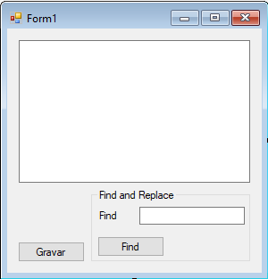

# Manipulação de strings


Em C# textos são representados por objetos do tipo `string`. Para criar um texto, podemos usar a seguinte sintaxe:

``` csharp
string  titulo= "Arquitetura e Design de Software";
MessageBox.Show(titulo); // imprime o conteúdo
```

Podemos ainda juntar duas strings:

``` csharp
string titulo = "Arquitetura" + " e " + " Design de Software";
titulo += " ! " // concatena a ! no fim do texto
```

Usando a concatenação, podemos inserir o valor de qualquer variável no meio de nosso texto:

``` csharp
int idade = 42;
MessageBox.Show("a idade atual é " + idade);
```

Mas ficar concatenando _strings_ nem sempre é fácil, principalmente se temos muitos valores. Podemos usar uma alternativa, fazendo o próprio **C#** fazer essa concatenação por nós. Para isso, basta indicar na `string` a posição que quer inserir a variável usando a sintaxe `{posicao}`, e passar o valor correspondente em ordem:

``` csharp
string nome = "Guilherme";
int idade = 42;
Console.WriteLine("Olá {0}, a sua idade é {1}", nome, idade);
```

Caso precisemos armazenar a string já concatenada em uma variável ao invés de a imprimir, basta usar o método `Format`:

``` csharp
string nome = "Guilherme"
int idade = 42;
string txt = string.Format("Olá {0}, a sua idade é {1}", nome, idade);
MessageBox.Show(txt);
```

Imagine que temos uma linha de texto que separa os dados de um usuário do sistema através de vírgulas:

``` csharp
string texto = "guilherme silveira,42,são paulo,brasil";
```

Como separar cada uma das partes através da `,`? A classe `String` conta também com um método `Split`, que divide a `String` em um array de `Strings`, dado determinado caractere como critério:

``` csharp
string texto = "guilherme silveira,42,são paulo,brasil";
string[] colunas = texto.Split(',');
```

Sempre que chamamos um método em um objeto `String`, um novo objeto é criado e retornado pelo método, mas o original nunca é modificado. `Strings` são **imutáveis**. Portanto ao tentarmos transformar em letra maiúscula o resultado pode não ser o esperado:

``` csharp
string curso = "fn13";
curso.ToUpper();
MessageBox.Show (curso); // imprime fn13
```

Sendo assim, quando queremos transformar em maiúsculo devemos atribuir o resultado do método:

``` csharp
string curso = "fn13";
string maiusculo = curso.ToUpper();
MessageBox.Show (maiusculo); // imprime FN13
```

Podemos substituir parte do conteúdo de uma `String`, usando o método `Replace`:

``` csharp
string curso = "fn13";
curso = curso.ToUpper();
curso = curso.Replace("1", "2");
MessageBox.Show (curso) // imprime FN23;
```

Podemos concatenar as invocações de método, já que uma string é devolvida a cada invocação:

``` csharp
string curso = "fn13";
curso = curso.toUpper().Replace("1", "2");
MessageBox.Show (curso) // imprime FN23;
```

Às vezes precisamos quebrar nossos textos em partes menores com base na quantidade de caracteres, ou ainda, encontrar a posição de um caractere específico dentro de nossa `string`:

``` csharp
string nomeCompleto = "guilherme silveira";
string nome = nomeCompleto.Substring(0,9);
MessageBox.Show (nome) // imprime guilherme;
```

E para buscar o caractere espaço dentro de uma `string`:

``` csharp
int posicaoDoEspaco = nomeCompleto.IndexOf(" ");
MessageBox.Show (posicaoDoEspaco); // imprime 8
```

Ou ainda, usar esses métodos em conjunto, para um exemplo mais avançado, no qual imprimimos o segundo nome:

``` csharp
string nomeCompleto = "guilherme silveira";

int inicioDoSegundoNome = nomeCompleto.IndexOf("s");

MessageBox.Show(nomeCompleto.Substring(inicioDoSegundoNome)); // imprime silveira 
```

## Exercícios
1. Observe o seguinte trecho de código:
	``` csharp

 string conteudo = "16,23,34,24,15,25,35,35,54,32";

 string[] idades =  ????;

 foreach( var n in idades)
 {
	MessageBox.Show(n);
 }
	```
	Qual trecho de código deve substituir as ??? para imprimir todos os números?

	* ``` csharpconteudo.Split(',');```

	* ``` csharpconteudo.Replace(" ", " \n");```

	* ``` csharpconteudo.Split(,);```

	* ``` csharpconteudo.Split(' ');```

	
1. Vamos agora melhorar o editor de texto que criamos no capítulo anterior utilizando as operações em string! Inicialmente, vamos incluir a funcionalidade de busca de strings na aplicação.

	Vamos criar mais um campo de texto no formulário que será utilizado pelo usuário para digitar o termo que será buscado no editor. Chame esse campo de texto de `textoBusca`. Além do campo de texto, inclua também um botão que, quando clicado, buscará o texto do `textoBusca` dentro do editor. Chame-o de `botaoBusca`. Seu formulário deve ficar parecido com o que segue:

	

	Agora que atualizamos o formulário, vamos implementar a funcionalidade de busca. Na ação do botão de busca, vamos utilizar o método `IndexOf` para implementar a busca:

	``` csharp
 private void botaoBusca_Click(object sender, EventArgs e)
 {
    string busca = textoBusca.Text;
    string textoDoEditor = textoConteudo.Text;
    int resultado = textoDoEditor.IndexOf(busca);
    if(resultado >= 0) 
    {
        MessageBox.Show("achei o texto " + busca);
    }
    else
    {
        MessageBox.Show("não achei");
    }
 }
	```

	Teste essa nova funcionalidade do programa.
1. Agora vamos implementar a funcionalidade find/replace que é muito comum nos editores de texto atuais. Para isso, vamos adicionar mais um campo de texto no formulário que será o `textoReplace`, além de um novo botão que quando clicado trocará todas as ocorrências de `textoBusca` por `textoReplace` dentro do editor. Esse botão será o
	`botaoReplace`.
1. Vamos agora adicionar um novo botão no formulário que quando clicado fará com que o texto do editor fique com letras maiúsculas. Utilize o método `ToUpper()` da String para fazer esse trabalho.
1. (Opcional) Adicione também um botão que utiliza o `ToLower()` da string.
1. (Opcional) Agora vamos fazer com que o botão `ToUpper` altere apenas o pedaço que o usuário selecionar do texto digitado ao invés de todo o texto. Para isso, utilizaremos duas novas propriedades do `TextBox` que lidam com seleção de texto: `SelectionStart` e `SelectionLength`.

	A propriedade `SelectionStart` nos diz em qual posição, começando em 0, do texto o usuário iniciou a seleção. `SelectionLength` nos devolve quantos caracteres do texto estão selecionados atualmente.

	Por exemplo, no texto abaixo:

	```
 Curso de C# da Caelum
	```

	Se o usuário selecionar a palavra `Curso`, `SelectionStart` devolverá 0 e `SelectionLength`, 5.

	Agora vamos utilizar essas duas novas propriedades para implementar o `ToUpper` na seleção:

	``` csharp
 private void botaoToUpper_Click(object sender, EventArgs e)
 {
    int inicioSelecao = textoConteudo.SelectionStart;
    int tamanhoSelecao = textoConteudo.SelectionLength;

    // agora vamos utilizar o Substring para pegar o texto selecionado
    string textoSelecionado = textoConteudo.Text
                    .Substring(inicioSelecao, tamanhoSelecao);

    // além do texto selecionado, precisamos do texto antes da seleção:
    string antes = textoConteudo.Text
                    .Substring(0, inicioSelecao);

    // e também do texto depois
    string depois = textoConteudo.Text
                    .Substring(inicioSelecao + tamanhoSelecao);

    // E agora só precisamos redefinir o campo texto
    textoConteudo.Text = antes + textoSelecionado.ToUpper() + depois;
 }
	```

	Tente fazer o mesmo para o botão `ToLower`.
